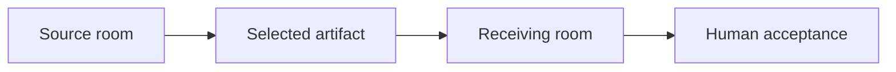

# North Star Architecture Impact Assessment v0.1

## 1. Document Status and Authority

| Field | Value |
|---|---|
| Status | Candidate Architecture Impact Assessment v0.1 |
| Authority | Non-normative; human review required; assessment only |
| Approval record | [GitHub Issue #12](https://github.com/frwkHoangQuy/Mnemograph_workbench/issues/12) |
| Primary vision inputs | [User Value System and Controlled Flywheel](../vision/user-value-system-and-flywheel-v0.1.md), [Maximal Scenario Envelope for the North Star](../vision/maximal-scenario-envelope-v0.1.md), and [North Star System Vision](../vision/north-star-system-vision-v1.0.md) |
| Normative inputs | [Project Charter](../baseline/Mnemograph_Triadic_Research_Workbench_Project_Charter_v1.0.md), [System Design](../baseline/Mnemograph_Triadic_Research_Workbench_System_Design_v0.1.md), [ADR-GOV-001](../adr/ADR-GOV-001-phase-namespace-reconciliation.md), and [ADR-DOMAIN-001](../adr/ADR-DOMAIN-001-pure-domain-and-published-contract-boundaries.md) |
| Assessment boundary | No architecture change, ADR decision, source-code change, Delivery D1 change, or Delivery D1.2 implementation is authorized. |
| Delivery boundary | Delivery D1.2 remains frozen pending a later human decision. |

This is a development-agent assessment, not a runtime Scientist or SA product role. It cannot produce or certify scientific evidence, make or accept normative product decisions, or approve an architecture change.

The current Project Charter, System Design, and accepted ADRs remain authoritative. This document identifies compatibility, clarification, and future-governance questions only. It does not supersede, amend, reinterpret, or replace any authoritative input.

## 2. Executive Compatibility Verdict

| Finding | Impact classification | Timing | Verdict |
|---|---|---|---|
| Modular-monolith foundation | Compatible as-is | Decision required before D1.2 | The accepted modular monolith with a worker remains a sound foundation for the exact first MVP and later bounded evolution. |
| Full redesign | Explicitly deferred or out of scope | North-Star-only preserve-option concern | No evidence in the candidate vision justifies a full redesign before a runnable MVP demonstrates a concrete boundary failure. |
| D1.2 strict schema foundation | Compatible with clarification | Decision required before D1.2 | It remains conceptually valid only if it preserves existing aggregate and record boundaries without generalizing Room, dynamic roles, governed memory, federation, or publication. |
| North Star candidate pressures | Extension seam required | Post-MVP candidate | Most pressures call for preserved boundaries and future governance artifacts, not horizontal subsystems now. |

The architecture is fundamentally reusable. The North Star primarily exposes vocabulary and future-boundary questions: how to speak precisely about a room, role policy, selected artifact exchange, governed memory, and cost-quality evaluation without treating any of them as an approved implementation requirement.

## 3. Assessment Scope, Inputs, Method, Classifications, and Limitations

### Scope and method

This assessment maps the candidate vision to the accepted baseline, accepted ADRs, current package layout, and verified Delivery D1 facts. It asks whether a North Star pressure is already covered, needs clarification, needs a later seam or bounded context, belongs to product or policy, conflicts with an accepted boundary, or must remain deferred.

The method is deliberately conservative:

1. Preserve accepted state ownership, dependency direction, and Delivery D# boundaries.
2. Treat candidate vision language as an assessment input, not a requirement source.
3. Prefer clarification and later governance over premature abstraction or platform construction.
4. Mark a conflict only where a proposed future direction would cross an accepted boundary.

### Impact classifications

| Classification | Meaning in this assessment |
|---|---|
| Compatible as-is | The accepted architecture already supports the needed boundary without an identified change. |
| Compatible with clarification | The baseline is suitable, but vocabulary, scope, or responsibility must be clarified before related work proceeds. |
| Extension seam required | A later capability should preserve a boundary or interface concern, without authorizing an implementation now. |
| Future bounded context or module | The pressure is substantial enough to merit a later ownership boundary if separately approved. |
| Potential conflict requiring ADR | A future proposal would cross an accepted boundary and would need an ADR before it could proceed. |
| Product/policy decision rather than architecture | The question is principally about authority, consent, ownership, thresholds, or business policy. |
| Explicitly deferred or out of scope | The pressure must not enter the named delivery scope or current MVP. |

### Timings

| Timing | Meaning in this assessment |
|---|---|
| Decision required before D1.2 | A human clarification is needed before the frozen D1.2 schema scope could be reconsidered. |
| Decision required before first runnable MVP | A minimal human policy or boundary must be clear before the first runnable user journey. |
| Post-MVP candidate | The question should be evaluated only after a running MVP supplies evidence. |
| North-Star-only preserve-option concern | The concern should remain visible in later architecture review but must not expand current work. |

### Limitations

- GitHub Issue #12 is the approval record for this candidate assessment. Its approval is limited to analysis and does not authorize architecture, ADR, source-code, Delivery D1, or Delivery D1.2 changes.
- The approved Delivery D1 Plan is not currently materialized as a standalone repository document. This assessment therefore relies on the accepted ADRs, repository evidence, and Lead-SA-verified delivery facts, and does not infer missing normative requirements.
- The current repository remains a foundation with D0 placeholders and D1.1 package naming evidence. It cannot provide runtime evidence for candidate North Star behavior.

## 4. Current Architecture Baseline Summary

| Baseline area | Current System Design or repository evidence | Impact classification | Timing | Assessment |
|---|---|---|---|---|
| Modular monolith with worker | System Design Sections 1, 3, and 10 | Compatible as-is | Decision required before D1.2 | The accepted structure contains the relevant logical boundaries without requiring early service extraction. |
| Goal Management and Deliberation | System Design Sections 4.2, 4.3, and 5; ADR-DOMAIN-001 D1-E | Compatible as-is | Decision required before D1.2 | Goal, Subgoal, and DeliberationSession already separate durable state ownership. |
| Evidence and claim governance | System Design Sections 4.4, 4.7, and 6 | Compatible as-is | Decision required before D1.2 | Source, evidence, claim, citation, and counter-evidence concerns already have named ownership. |
| Human decision and publication | System Design Sections 4.8, 4.9, and 5; ADR-DOMAIN-001 D1-E | Compatible as-is | Decision required before D1.2 | Human acceptance and later publication are separated from D1 behavior. |
| Role isolation and model boundary | System Design Sections 4.5, 4.6, 4.10, and 7 | Compatible with clarification | Decision required before D1.2 | Current Scientist and SA separation supports the MVP, while future role policy must not collapse into model selection. |
| Audit and replay | System Design Sections 4.11 and 8.4 | Compatible as-is | Decision required before first runnable MVP | Append-only audit concerns, immutable turns, and versioned replay are already compatible with reviewable work. |
| D1 package and contract boundary | [mnemograph-domain](../../libs/domain/README.md), [mnemograph-contracts](../../libs/contracts/README.md), and ADR-DOMAIN-001 | Compatible as-is | Decision required before D1.2 | D1.1 namespaced imports remain valid: distributions are `mnemograph-domain` and `mnemograph-contracts`; imports are `mnemograph_domain` and `mnemograph_contracts`. |

The System Design already names a technology baseline. This assessment selects no provider, database, vector store, queue, framework, cloud, authentication approach, or numerical SLA, and does not alter any accepted selection.

## 5. North Star Versus Triadic-MVP Relationship

The candidate North Star extends the vocabulary around a user-controlled evidence-to-action workbench. It does not replace the triadic MVP. The exact first-MVP room configuration is the user with Scientist, SA, and Moderator roles; it is not evidence that the product identity must be permanently hard-coded to those roles.

| Triadic interpretation | Current coverage | Impact classification | Timing | Assessment |
|---|---|---|---|---|
| Exact first-MVP configuration | System Design Sections 2.1, 3, 5, and 7; North Star Sections 6 and 21 | Compatible as-is | Decision required before first runnable MVP | Scientist, SA, and Moderator are the protected first-MVP configuration. |
| Moderator representation in D1.2 schemas | ADR-DOMAIN-001 D1-D defines `USER`, `SCIENTIST`, `SA`, and `SYSTEM` actors | Compatible with clarification | Decision required before D1.2 | A human clarification must establish whether Moderator is an orchestration policy, a visible system participation, or a separately modeled role. This assessment makes no choice. |
| Reusable specialized role policies | System Design Sections 4.5, 4.6, 4.10, and 7 | Extension seam required | Post-MVP candidate | A later role policy may distinguish purpose, allowed sources, tool permissions, authority, and output contract. No dynamic-role implementation is authorized. |
| Hard-coded permanent product identity | No accepted baseline requirement | Explicitly deferred or out of scope | North-Star-only preserve-option concern | The triadic configuration must not be generalized into a permanent product identity merely because it is the first MVP. |

## 6. Room Semantic Assessment

The candidate vision uses Room as a user-facing boundary for purpose, permitted context, participants, reviewable artifacts, authority limits, and sharing choices. The accepted architecture already owns the durable MVP states through Goal and DeliberationSession. This is primarily a vocabulary limitation, not evidence that a new aggregate is required.

| Candidate Room interpretation | Current coverage | Impact classification | Timing | Assessment |
|---|---|---|---|---|
| Clarified conceptual boundary for the standalone MVP | Goal Management and Deliberation modules | Compatible with clarification | Decision required before D1.2 | The first-MVP room can be described without a new schema or aggregate. |
| Application-level composition around Goal and DeliberationSession | System Design Sections 4.2, 4.3, and 5 | Compatible with clarification | Decision required before D1.2 | This is a plausible explanatory composition, not a normative selection or authorization. |
| Domain aggregate named Room | No accepted aggregate ownership | Explicitly deferred or out of scope | Post-MVP candidate | D1.2 must not create a Room aggregate merely to anticipate future topology. |
| Later bounded context for room topology or exchange | No accepted room-network module | Future bounded context or module | Post-MVP candidate | A later architecture review may decide whether separate ownership is warranted after MVP evidence exists. |

No room federation, raw-context propagation, or cross-room automation follows from this assessment.

## 7. Goal, Subgoal, and DeliberationSession Reuse Assessment

| Existing ownership | North Star relevance | Impact classification | Timing | Assessment |
|---|---|---|---|---|
| Goal owns decomposition, approved-plan linkage, and progress to `FINAL_CANDIDATE` or `STOPPED` | Supports a bounded user goal and a justified stop decision | Compatible as-is | Decision required before D1.2 | The North Star does not require Goal to own rooms, memory, publication, or organization topology. |
| Subgoal has an independently testable lifecycle and user-only acceptance or reopen behavior | Supports visible uncertainty, revision, and human control | Compatible as-is | Decision required before D1.2 | Existing separation prevents a broad room abstraction from absorbing subgoal state. |
| DeliberationSession owns immutable turns, checkpoints, interventions, pause/resume, and branch history | Supports the standalone room interaction and reviewability | Compatible as-is | Decision required before D1.2 | The session is already a natural owner for the bounded deliberation history. |
| Claim, EvidenceLink, and ArchitectureIssue remain separate records or contracts | Supports epistemic clarity and attributable disagreement | Compatible as-is | Decision required before D1.2 | The North Star reinforces, rather than collapses, these record boundaries. |
| D1 ends at `FINAL_CANDIDATE` | Supports a deliberate handoff before acceptance and publication | Compatible as-is | Decision required before D1.2 | Accepted-result, publication, and completion behavior remain Delivery D5 concerns. |

## 8. Dynamic Role-Agent and Role-Policy Assessment

The North Star treats dynamic role-agents as a candidate mature-state possibility. The accepted MVP has dedicated Scientist and SA reasoning boundaries, user oversight, and a Moderator role in the protected room configuration. That is sufficient for the first journey and should not be over-generalized.

| Role pressure | Current System Design coverage | Impact classification | Timing | Assessment |
|---|---|---|---|---|
| Scientist and SA specialization | System Design Sections 4.5, 4.6, and 7 | Compatible as-is | Decision required before first runnable MVP | Separate purposes and tool scopes already protect the MVP. |
| Moderator and user intervention | System Design Sections 4.3, 5.3, and 5.4 | Compatible with clarification | Decision required before D1.2 | D1.2 needs only the minimum representation necessary for the exact MVP; it must not infer generic role management. |
| Reusable role policy | System Design Sections 4.5, 4.6, and 7 | Extension seam required | Post-MVP candidate | Later policy may separate purpose, allowed sources, tool permissions, authority, and output contract. |
| Temporary specialist, reviewer, coordinator, or auditor | No accepted dynamic-role module | Future bounded context or module | Post-MVP candidate | Any future role diversity needs separate human approval, scope, and authority boundaries. |
| Role-agent authority expansion | System Design Sections 4.8, 7, and 14 | Explicitly deferred or out of scope | North-Star-only preserve-option concern | A role label cannot confer legal, financial, contractual, publishing, production, or human decision authority. |

## 9. Role Versus Model/Provider/Tool Boundary Assessment

**Role != Model** remains valid. The accepted Model Gateway is provider-neutral and the accepted role contracts remain distinct from provider behavior. The North Star adds future policy pressures; it does not authorize a model, provider, tool, routing, or cost-policy selection.

| Boundary | Current coverage | Impact classification | Timing | Assessment |
|---|---|---|---|---|
| Role purpose and authority | System Design Sections 4.5, 4.6, and 7 | Compatible as-is | Decision required before first runnable MVP | Role purpose and authority remain separate from model capability. |
| Model/provider behavior and version capture | System Design Sections 4.10, 4.11, 7.3, and Charter Section 10 | Compatible as-is | North-Star-only preserve-option concern | Existing provider-neutrality and version capture support later comparison without selecting a provider. |
| Tool permissions and external effects | System Design Sections 7 and 14 | Extension seam required | Post-MVP candidate | A later policy boundary may govern permitted tools, but no tool implementation is authorized. |
| Cost policy and quality trade-offs | System Design Sections 4.10 and 4.11 | Compatible with clarification | Post-MVP candidate | Cost accounting can remain separate from product-value and business-finance decisions. |
| Provider or storage migration continuity | System Design Sections 4.10, 4.11, and 8.4 | Extension seam required | North-Star-only preserve-option concern | Preserve provenance, scope, version, and human decision history without selecting a provider or storage technology. |

## 10. Evidence, Claim, Citation, and Epistemic Assessment

The accepted Evidence, Claim and Citation Governance, Architecture Review, and Audit boundaries are a strong fit for the North Star's evidence-aware language. The assessment does not create new schemas or decide which classifications belong in D1.2.

| Epistemic pressure | Current System Design coverage | Impact classification | Timing | Assessment |
|---|---|---|---|---|
| Claims, evidence, objections, uncertainty, and rationale | System Design Sections 4.4, 4.7, 6.2, 6.4, and 7.3 | Compatible as-is | Decision required before first runnable MVP | Existing source locators, evidence links, claim lifecycle, and structured draft validation align with reviewable artifacts. |
| User material, scientific sources, current web sources, organizational knowledge, and deterministic tool output | System Design Sections 4.4 and 6 | Compatible with clarification | Post-MVP candidate | Source status and permitted use require clear vocabulary, but no new storage or retrieval design follows. |
| Model prior knowledge, inference, assumption, recommendation, and accepted knowledge | System Design Sections 4.5 through 4.8 | Compatible with clarification | Decision required before D1.2 | D1.2 may preserve the current Claim, EvidenceLink, and ArchitectureIssue foundation; it must not introduce acceptance or memory-promotion behavior. |
| Corrected, retracted, unavailable, or changed sources | System Design Sections 6.2 through 6.4 and 8.4 | Extension seam required | Post-MVP candidate | Later evaluation should preserve source version, observation time, status, uncertainty, and re-evaluation concern. |
| Prompt injection and malicious content | System Design Section 6.5 and Section 14 | Compatible as-is | Decision required before first runnable MVP | The baseline already treats documents as untrusted input and separates content from instructions. Future changes must preserve that boundary. |

Private model chain-of-thought remains neither required nor exposed. Reviewable rationale, evidence basis, uncertainty, and human decisions are the relevant artifact boundary.

## 11. Context Versus Governed Memory Assessment

The candidate vision distinguishes bounded interaction context from persistent governed memory. The baseline supports immutable deliberation history, snapshots, and auditability, but it does not authorize organizational memory, retention, deletion, or retrieval architecture.

| Concern | Current System Design coverage | Impact classification | Timing | Assessment |
|---|---|---|---|---|
| Bounded interaction context | System Design Sections 5, 7, and 8.4 | Compatible with clarification | Decision required before first runnable MVP | Context selection must not imply completeness; omitted context and uncertainty remain visible concerns. |
| Long-running provenance, assumptions, evidence, and prior human decisions | System Design Sections 4.11 and 8.4 | Extension seam required | Post-MVP candidate | Existing audit and versioning are useful foundations, but no unlimited context assumption is made. |
| Governed memory, accepted knowledge, and memory candidates | System Design Sections 4.8 and 8.4 provide related governance and replay concepts | Future bounded context or module | Post-MVP candidate | A future boundary may be warranted only after separate human decisions about ownership, scope, approval, and reuse. |
| Retention, correction, revocation, deletion, and reuse | System Design Section 17 leaves related policy open | Product/policy decision rather than architecture | Post-MVP candidate | No database, object store, vector store, retrieval method, summarization method, retention technology, or deletion mechanism is selected. |

## 12. Cross-Room Selected-Artifact Exchange Assessment

The North Star's candidate room network should preserve selected-artifact exchange rather than raw-context propagation. The accepted architecture has evidence, claim, decision, publication, and audit boundaries that could inform a later review, but it has no approved room-federation design.

This is an assessment relationship, not approved implementation architecture or a federation protocol.

| Exchange concern | Current coverage | Impact classification | Timing | Assessment |
|---|---|---|---|---|
| Selected, reviewable artifact exchange | Claim, Evidence, Decision, Publication, and Audit modules | Extension seam required | North-Star-only preserve-option concern | Any later exchange must retain provenance, source-room identity, uncertainty, consent, and receiving-room acceptance. |
| Visible conflicting conclusions | Architecture Review, Claim and Citation Governance, and Human Decision Gate | Extension seam required | Post-MVP candidate | Conflicting conclusions must remain attributable and unresolved until an authorized human accepts, defers, reconciles, or retains the disagreement. |
| Raw-context propagation | No accepted authorization | Explicitly deferred or out of scope | North-Star-only preserve-option concern | A room link must not imply unrestricted context, authority, memory, or privacy transfer. |
| Room federation | No accepted architecture | Explicitly deferred or out of scope | Post-MVP candidate | No federation design, cross-room automation, or synchronization behavior is authorized. |

## 13. Human Authority, Decision, Publication, and External-Action Assessment

| Human-control concern | Current System Design coverage | Impact classification | Timing | Assessment |
|---|---|---|---|---|
| Acceptance, stopping, pausing, reopening, and scope revision | System Design Sections 4.3, 4.8, 5.1, and 5.4 | Compatible as-is | Decision required before first runnable MVP | Human authority is already central to the durable workflow and must remain explicit. |
| Sharing and memory promotion | System Design Sections 4.1, 4.8, 4.11, and 14 provide adjacent boundaries | Product/policy decision rather than architecture | Post-MVP candidate | Future consent and promotion thresholds require human policy rather than inferred role authority. |
| Publication | System Design Section 4.9 and Delivery D5; ADR-DOMAIN-001 D1-E | Compatible as-is | Decision required before D1.2 | D1 stops at `FINAL_CANDIDATE`; accepted-result, publication, and completion behavior belong to Delivery D5. |
| External communication, financial, legal, contractual, and production action | System Design Sections 4.8, 7, 9, and 14 | Potential conflict requiring ADR | Post-MVP candidate | A future proposal that permits an external consequential effect would need explicit human authority and an ADR before any implementation. |
| Normative change | Charter Section 4 and System Design Section 4.8 | Compatible as-is | Decision required before first runnable MVP | No runtime role-agent may make or accept a normative decision. |

## 14. Evaluation, Model FinOps, and Business Finance Assessment

Business Finance, Model FinOps, outcome evaluation, and controlled-improvement proposals are related but distinct concerns. No role-agent receives spending authority or authority to autonomously change the system.

| Concern | Current System Design coverage | Impact classification | Timing | Assessment |
|---|---|---|---|---|
| Outcome evaluation | System Design Sections 4.11, 13, and Delivery D6 | Extension seam required | Post-MVP candidate | Later evaluation may measure user outcomes, evidence quality, and harmful effects without treating activity as value. |
| Model FinOps | System Design Sections 4.10 and 4.11 include token and cost accounting | Compatible with clarification | Post-MVP candidate | Model-related resource observation remains distinct from product or business financial decisions. |
| Business Finance | No accepted business-finance module or authority | Product/policy decision rather than architecture | Post-MVP candidate | Pricing, revenue, investment, commitments, and budgets remain human organizational decisions. |
| Controlled improvement | System Design Delivery D6 and North Star Section 16 | Explicitly deferred or out of scope | Post-MVP candidate | No self-improvement runtime, autonomous optimization, or automatic policy change is authorized. |

## 15. Identity, Access, Consent, Ownership, and Audit Assessment

| Concern | Current System Design coverage | Impact classification | Timing | Assessment |
|---|---|---|---|---|
| Minimal first-MVP identity and access boundary | System Design Sections 4.1, 9, 14, and 17 | Compatible with clarification | Decision required before first runnable MVP | A human policy must identify who may access the one user's permitted context; this assessment selects no authentication approach. |
| Ownership, sharing scope, consent, and revocation | System Design Sections 4.1, 4.8, 4.11, 14, and 17 | Product/policy decision rather than architecture | Post-MVP candidate | Candidate privacy and consent scopes require later policy decisions before broader sharing or governed memory. |
| Auditability and decision history | System Design Sections 4.11 and 8.4 | Compatible as-is | Decision required before first runnable MVP | Append-only audit and immutable turns provide a compatible baseline for attributable human decisions. |
| Multi-room or organizational access | No accepted room-network access model | Future bounded context or module | Post-MVP candidate | This must not be inferred from a room link, role label, or organizational metaphor. |

## 16. Bounded Modules and Dependency-Direction Assessment

The North Star does not invalidate the accepted module boundaries or dependency direction. It reinforces the need to keep inward domain or application ports outside published DTOs and to prevent provider, persistence, and policy concerns from leaking into the pure domain.

| Boundary | Current ownership and direction | Impact classification | Timing | Assessment |
|---|---|---|---|---|
| Goal Management and Deliberation | System Design Sections 4.2 and 4.3; pure domain aggregates under ADR-DOMAIN-001 | Compatible as-is | Decision required before D1.2 | Preserve Goal, Subgoal, and DeliberationSession ownership without adding Room to D1.2. |
| Evidence, Scientific Reasoning, Architecture Review, and Claim Governance | System Design Sections 4.4 through 4.7 | Compatible as-is | Decision required before D1.2 | Preserve separate source, claim, review, and decision concerns. |
| Decision, Publication, and Audit | System Design Sections 4.8, 4.9, and 4.11 | Compatible as-is | Decision required before D1.2 | Preserve the D1 `FINAL_CANDIDATE` handoff and later Delivery D5 publication boundary. |
| Model Gateway and prompts | System Design Sections 4.10, 7, and 11.1 | Compatible as-is | North-Star-only preserve-option concern | Keep provider behavior and prompt versions outside domain decisions. |
| Governed memory | No accepted module owns it | Future bounded context or module | Post-MVP candidate | Consider only after evidence justifies a separate ownership and policy boundary. |
| Room topology and selected-artifact exchange | No accepted federation or topology module | Future bounded context or module | Post-MVP candidate | Consider only after the standalone journey runs and a later ADR establishes responsibility. |
| Dynamic role policy and evaluation | Existing agent, Model Gateway, Audit, and evaluation package boundaries are adjacent | Extension seam required | Post-MVP candidate | Preserve separation before deciding whether a future bounded module is necessary. |

No distributed-monolith evolution, microservice extraction, or additional horizontal platform is justified by this assessment.

## 17. Delivery D1 and D1.2 Impact Verdict

| Question | Verdict | Impact classification | Timing | Boundary |
|---|---|---|---|---|
| Does D1.1 remain valid? | Yes. The merged namespaced-package rename remains compatible with the North Star. | Compatible as-is | Decision required before D1.2 | Distribution names remain `mnemograph-domain` and `mnemograph-contracts`; imports remain `mnemograph_domain` and `mnemograph_contracts`. |
| Does ADR-DOMAIN-001 remain valid? | Yes. Pure-domain, published-contract, dependency, primitive, and state-ownership decisions remain useful. | Compatible as-is | Decision required before D1.2 | No North Star pressure justifies domain imports of frameworks, providers, storage, queues, or contracts. |
| Does the planned D1.2 schema foundation remain conceptually valid? | Yes, conditionally. | Compatible with clarification | Decision required before D1.2 | It must remain a strict schema foundation for current aggregates and records, not a platform for candidate future concepts. |
| Would D1.2 prematurely hard-code Scientist/SA, Room, memory, room federation, or publication concepts? | It would if its scope generalizes them beyond the exact MVP and accepted D1 boundary. | Potential conflict requiring ADR | Decision required before D1.2 | D1.2 must not create a generalized role platform, Room aggregate, memory model, federation contract, or Delivery D5 publication behavior. |
| Is any decision required before D1.2 could resume? | Yes. Human clarification of the minimum scope guardrails is required; this assessment does not resume or authorize D1.2. | Compatible with clarification | Decision required before D1.2 | See Section 22 for candidate clarification inventory. |
| Which North Star concepts remain outside Delivery D1? | Dynamic roles, room topology, selected-artifact exchange, governed memory, consent policy, external integration, provider or tool policy, finance, evaluation, controlled improvement, acceptance, and publication behavior. | Explicitly deferred or out of scope | Post-MVP candidate | These concepts require later human-approved scope and governance artifacts. |

Delivery D1 behavior remains bounded by `FINAL_CANDIDATE`. D1.2 remains frozen and unauthorized until a later human decision establishes a separately approved scope and plan.

## 18. Exact First-MVP Architecture Protection

| Protection finding | Impact classification | Timing | Assessment |
|---|---|---|---|
| Exact first-MVP boundary | Compatible as-is | Decision required before first runnable MVP | The following boundary is protected verbatim for this assessment and must not be expanded by North Star terminology. |

- one user;
- one standalone room;
- Scientist, SA, and Moderator roles;
- user-provided permitted context;
- bounded deliberation;
- visible claims, objections, evidence, and rationale;
- user intervention and termination authority;
- Scientific Rationale;
- Architecture Advisory;
- no room federation;
- no Learning Studio behavior;
- no organizational-memory promotion automation;
- no self-improvement runtime;
- no autonomous consequential action.

The assessment resists building horizontal North Star subsystems before this journey runs. Candidate room networks, dynamic roles, governed memory, external integrations, and controlled improvement must not delay or displace the protected journey.

## 19. Eleven Mature-State Pressure-Group Dispositions

| Mature-state grouping | Current System Design coverage | Impact classification | Timing | MVP effect | Candidate future governance artifact |
|---|---|---|---|---|---|
| 1. User and organizational scale | Sections 1, 2.1, 10, and 17 recognize limited MVP scope and later operational questions | Compatible with clarification | North-Star-only preserve-option concern | No scale or multi-organization expansion | Later discovery |
| 2. Room topology | Sections 4.2 and 4.3 provide Goal and Deliberation ownership; no room-network module exists | Extension seam required | North-Star-only preserve-option concern | No federation or linked rooms | Clarification, then later ADR proposal if justified |
| 3. Role and authority diversity | Sections 4.5, 4.6, 4.8, 7, and ADR-DOMAIN-001 D1-D | Compatible with clarification | Decision required before D1.2 | Preserve the exact triadic configuration without generic role management | Clarification; ADR proposal only if accepted role ownership changes |
| 4. Evidence and source change | Sections 4.4, 4.7, 6, and 8.4 | Compatible with clarification | Post-MVP candidate | Preserve source and claim distinctions; no monitoring implementation | Clarification |
| 5. Memory and context longevity | Sections 4.11 and 8.4 support audit and replay, but not governed memory | Future bounded context or module | Post-MVP candidate | No memory promotion or context architecture | Product/policy decision and later ADR proposal if justified |
| 6. Provider, model, and tool diversity | Sections 4.10, 4.11, 7, and 11.1 preserve Model Gateway and role isolation | Extension seam required | North-Star-only preserve-option concern | No provider, model, or tool selection | Later discovery or ADR proposal if a boundary changes |
| 7. Market and commercial feedback | No commercial bounded module or financial authority is accepted | Product/policy decision rather than architecture | Post-MVP candidate | No commercial automation or success claim | Product/policy decision |
| 8. External integration | Sections 4.8, 7, 9, and 14 protect human approval around effects | Potential conflict requiring ADR | Post-MVP candidate | No external integration or action | ADR proposal and product/policy decision |
| 9. Security and consent | Sections 4.1, 6.5, 14, and 17 provide security and access boundaries | Product/policy decision rather than architecture | Decision required before first runnable MVP | Preserve permitted context and untrusted-content boundaries | Product/policy decision |
| 10. Cost and reliability | Sections 4.10, 4.11, 5.1, and 14 cover accounting, limits, audit, and safety | Compatible with clarification | Post-MVP candidate | Bounded deliberation and human choice remain protected | Later discovery |
| 11. Controlled system improvement | Section 13 and Delivery D6 place evaluation and hardening later | Explicitly deferred or out of scope | Post-MVP candidate | No self-improvement runtime | System Design revision proposal or ADR proposal after evidence exists |

## 20. Decision and Evolution Matrix

| North Star pressure | Vision source/section | Current System Design section/module | Current coverage | Impact classification | Timing | MVP impact | Candidate future governance artifact | Rationale |
|---|---|---|---|---|---|---|---|---|
| Exact standalone triadic room | North Star Sections 6 and 21 | Sections 3, 4.2, 4.3, 5, and 7 | Goal, deliberation, and role boundaries exist | Compatible as-is | Decision required before first runnable MVP | Protects the vertical journey | None | The first MVP already has a bounded user-controlled deliberation shape. |
| Moderator representation | North Star Sections 6 and 21 | Section 4.3; ADR-DOMAIN-001 D1-D | Orchestration and actor kinds are adjacent but not explicitly aligned | Compatible with clarification | Decision required before D1.2 | No behavior expansion | Clarification | Clarify representation without introducing dynamic role management. |
| Room as a conceptual boundary | North Star Sections 2 and 7 | Sections 4.2 and 4.3 | Existing aggregates cover the durable state | Compatible with clarification | Decision required before D1.2 | No Room aggregate | Clarification | Room terminology need not become D1 schema ownership. |
| Selected-artifact exchange | North Star Sections 7 and 13; MSE-02 and MSE-14 | Sections 4.4, 4.7 through 4.11 | Artifact, decision, and audit concepts exist; no exchange boundary | Extension seam required | North-Star-only preserve-option concern | No room link | Later discovery | Preserve provenance, consent, uncertainty, and receiving-room acceptance. |
| Visible conflicting conclusions | North Star Section 7; MSE-04 | Sections 4.6 through 4.8 | Review, issues, and human decisions exist within the MVP | Extension seam required | Post-MVP candidate | No automatic consensus | Clarification | Cross-room conflict handling must not silently override a conclusion. |
| Reusable role policy | North Star Sections 8 through 10; MSE-03 and MSE-17 | Sections 4.5, 4.6, 4.10, and 7 | Fixed role isolation exists; policy abstraction is not accepted | Extension seam required | Post-MVP candidate | No dynamic roles | Later discovery | Purpose, sources, tools, authority, and output remain distinct from model choice. |
| Source status and changing evidence | North Star Section 11; MSE-08 and MSE-09 | Sections 4.4, 4.7, 6, and 8.4 | Source snapshot, locators, and audit exist | Compatible with clarification | Post-MVP candidate | No monitoring implementation | Clarification | Later review needs status, observation time, and re-evaluation vocabulary. |
| Untrusted content | North Star Section 11; MSE-13 | Sections 6.5 and 14 | Explicit prompt-injection boundary exists | Compatible as-is | Decision required before first runnable MVP | Preserve the boundary | None | Content remains evidence to evaluate, not authority or system instruction. |
| Governed memory | North Star Sections 12 and 13; MSE-05 through MSE-07 | Sections 4.8, 4.11, and 8.4 | Audit and decision history exist; governed memory does not | Future bounded context or module | Post-MVP candidate | No memory promotion automation | Product/policy decision and later ADR proposal | Ownership, consent, retention, revocation, and reuse are not D1 concerns. |
| Provider and storage continuity | North Star Sections 14 and 19; MSE-10, MSE-11, and MSE-16 | Sections 4.10, 4.11, 8.4, and 11.1 | Provider-neutral gateway and version capture exist | Extension seam required | North-Star-only preserve-option concern | No selection or migration work | Later discovery | Preserve artifact meaning across future change without choosing technology. |
| Human authority and publication | North Star Sections 18 and 21; MSE-15 | Sections 4.8, 4.9, 5, and 7 | Human gate and later publication boundary exist | Compatible as-is | Decision required before D1.2 | D1 remains at `FINAL_CANDIDATE` | None | Delivery D5 owns acceptance, publication, and completion behavior. |
| Market and commercial feedback | North Star Sections 15 through 17; MSE-19 and MSE-20 | Sections 4.8, 4.11, and Delivery D6 | Outcome and governance concepts are adjacent; no commercial module exists | Product/policy decision rather than architecture | Post-MVP candidate | No commercial automation | Product/policy decision | Scientific support and web attention do not establish commercial value. |
| Security, consent, and sharing | North Star Sections 11 through 13; MSE-07 and MSE-14 | Sections 4.1, 4.8, 4.11, 6.5, and 14 | Baseline security and audit boundaries exist; policy remains open | Product/policy decision rather than architecture | Decision required before first runnable MVP | Preserve private permitted context | Product/policy decision | Future scope, consent, retention, and revocation need human policy. |
| Cost, reliability, and controlled improvement | North Star Sections 14, 16, and 19; MSE-12 and MSE-18 | Sections 4.10, 4.11, 5.1, 13, and Delivery D6 | Accounting and bounded workflow exist; improvement is later | Explicitly deferred or out of scope | Post-MVP candidate | No self-improvement runtime | Later discovery | Cost does not override user outcomes, provenance, or human control. |
| External consequential action | North Star Section 18; MSE-15 | Sections 4.8, 7, 9, and 14 | Human gate exists; no external action capability is approved | Potential conflict requiring ADR | Post-MVP candidate | No external action | ADR proposal and product/policy decision | Any future external effect needs explicit human authority and a new decision record. |

## 21. Risks and Failure Modes

| Risk | Impact classification | Timing | Assessment response |
|---|---|---|---|
| Premature platform construction | Explicitly deferred or out of scope | Decision required before D1.2 | Keep D1.2 a strict foundation and resist horizontal North Star subsystems. |
| Hard-coded triadic assumptions | Compatible with clarification | Decision required before D1.2 | Preserve the exact MVP configuration without treating it as permanent product identity. |
| Over-generalized Room or Role abstractions | Extension seam required | Decision required before D1.2 | Clarify the conceptual boundary; defer general abstractions until evidence justifies them. |
| Room-context coupling | Explicitly deferred or out of scope | North-Star-only preserve-option concern | Do not imply that a room link transfers raw context or authority. |
| Memory-evidence coupling | Future bounded context or module | Post-MVP candidate | Keep memory candidates, accepted knowledge, source evidence, and decision history distinguishable. |
| Role-model coupling | Compatible with clarification | Decision required before D1.2 | Preserve `Role != Model` and keep provider behavior outside domain decisions. |
| Authority leakage | Potential conflict requiring ADR | Decision required before first runnable MVP | Maintain explicit human approval for acceptance, sharing, publication, and consequential action. |
| Raw-context propagation | Explicitly deferred or out of scope | North-Star-only preserve-option concern | Preserve selected-artifact exchange as the only future evaluation posture. |
| Provenance loss | Extension seam required | Post-MVP candidate | Preserve source identity, version, uncertainty, and human decision history in later evaluation. |
| Distributed-monolith evolution | Explicitly deferred or out of scope | Post-MVP candidate | Do not extract services or add platforms merely to represent candidate boundaries. |
| Excessive time-to-first-value | Compatible as-is | Decision required before first runnable MVP | Protect the one-user standalone journey before adding broader capabilities. |
| Treating candidate options as accepted requirements | Explicitly deferred or out of scope | North-Star-only preserve-option concern | Require separate human-approved governance artifacts before any future work. |

## 22. Candidate ADR/System Design Clarification Inventory

The following are candidate governance artifacts only. None is created, accepted, or authorized by this assessment.

| Candidate clarification or artifact | Impact classification | Timing | Why it may be needed |
|---|---|---|---|
| D1.2 scope guardrail for strict schema work | Compatible with clarification | Decision required before D1.2 | Record that D1.2 must not generalize Room, dynamic roles, memory, federation, or Delivery D5 publication. |
| Moderator and `ActorKind` representation | Compatible with clarification | Decision required before D1.2 | Resolve the vocabulary alignment only if needed for a strict first-MVP schema. |
| Room semantic and ownership decision | Extension seam required | Post-MVP candidate | Decide whether a future Room is an aggregate, application composition, bounded context, or remains a conceptual boundary only after evidence exists. |
| Selected-artifact exchange and conflicting conclusions | Extension seam required | Post-MVP candidate | A later ADR proposal may be needed if cross-room exchange becomes approved scope. |
| Governed memory and lifecycle policy | Future bounded context or module | Post-MVP candidate | A later product/policy decision and possible ADR may define ownership, promotion, correction, revocation, retention, and deletion. |
| Provider or storage migration continuity | Extension seam required | North-Star-only preserve-option concern | Preserve provenance, scope, version, and human decision history without choosing a technology. |
| External consequential action | Potential conflict requiring ADR | Post-MVP candidate | Any proposal for external effect, delegation, or integration needs explicit human authority and a new ADR. |
| Controlled improvement | Explicitly deferred or out of scope | Post-MVP candidate | A later System Design revision proposal or ADR could be considered only after outcome evidence and human review. |

## 23. Open Human Decisions

| Open decision | Impact classification | Timing | Reason for human decision |
|---|---|---|---|
| Whether and under what approval a frozen D1.2 scope may resume | Compatible with clarification | Decision required before D1.2 | The assessment cannot authorize resumption or modify the D1 boundary. |
| How Moderator should be represented for the exact MVP | Compatible with clarification | Decision required before D1.2 | The current ActorKind vocabulary and protected MVP role wording need alignment without premature generalization. |
| Whether a future Room gains separate state ownership | Future bounded context or module | Post-MVP candidate | The correct answer depends on evidence from a running standalone journey. |
| Which selected artifacts may cross future room boundaries | Product/policy decision rather than architecture | Post-MVP candidate | Scope, consent, privacy, provenance, and receiving acceptance require human governance. |
| What constitutes accepted knowledge, a memory candidate, and governed memory | Product/policy decision rather than architecture | Post-MVP candidate | Thresholds, ownership, correction, and revocation are not implied by an architecture label. |
| Which dynamic roles or tool permissions create enough value to assess | Extension seam required | Post-MVP candidate | Role diversity must not create authority or access by implication. |
| What human authorization is necessary before any external consequential action | Potential conflict requiring ADR | Post-MVP candidate | Legal, financial, contractual, publishing, production, and communication effects require explicit governance. |
| How outcome evaluation, Model FinOps, and controlled improvement should be governed | Product/policy decision rather than architecture | Post-MVP candidate | Cost, quality, evidence, user outcomes, and opt-in cannot be reduced to a single automated rule. |

## 24. Recommended Governance Sequence

| Step | Human-governed action | Guardrail | Timing |
|---|---|---|---|
| 1 | Review this candidate assessment against the accepted baseline and ADRs. | It remains non-normative and does not authorize a change. | Decision required before D1.2 |
| 2 | Decide whether to retain D1.2 frozen or approve a separate clarification and plan. | No resumption follows from this assessment alone. | Decision required before D1.2 |
| 3 | If D1.2 is later reconsidered, approve strict scope guardrails and resolve only necessary first-MVP vocabulary. | Do not introduce Room, dynamic-role, memory, federation, or publication abstractions. | Decision required before D1.2 |
| 4 | Build and evaluate the protected standalone MVP journey through approved delivery work. | Resist horizontal North Star subsystems before runnable evidence exists. | Decision required before first runnable MVP |
| 5 | Use observed user value, provenance quality, authority safety, and reversibility to assess one bounded future pressure at a time. | Candidate possibilities remain optional and separately reviewable. | Post-MVP candidate |
| 6 | Create a proposed ADR or System Design revision only when a bounded future capability crosses an accepted boundary. | Human review and approval remain required before any implementation. | Post-MVP candidate |

## 25. Final Conclusions and Explicit Non-Authorization Statement

| Conclusion | Impact classification | Timing | Assessment |
|---|---|---|---|
| Architecture foundation | Compatible as-is | Decision required before D1.2 | The modular-monolith strategy remains appropriate and fundamentally reusable. |
| Full redesign | Explicitly deferred or out of scope | North-Star-only preserve-option concern | No redesign is justified by the candidate North Star. |
| Minimum pre-D1.2 decisions | Compatible with clarification | Decision required before D1.2 | Confirm strict D1.2 non-goals, align Moderator vocabulary if needed, preserve `FINAL_CANDIDATE`, and keep candidate future concepts out of contracts. |
| Deferred North Star capabilities | Explicitly deferred or out of scope | Post-MVP candidate | Room federation, governed memory, dynamic roles, external integration, controlled improvement, and commercial automation wait for a running MVP and later human review. |
| Preserve-option boundaries | Extension seam required | North-Star-only preserve-option concern | Role/model separation, selected-artifact exchange, source status, migration continuity, provenance, consent, and human authority should remain visible without implementation commitment. |

This document does not authorize an architecture change, ADR decision, System Design revision, Delivery D1 change, Delivery D1.2 implementation, source-code change, provider or model selection, database or storage selection, queue or framework selection, authentication selection, room federation, memory implementation, self-improvement runtime, external action, or numerical SLA commitment.

This is a development agent, not a runtime Scientist or SA product role. It cannot make or accept normative decisions, certify scientific evidence, or authorize future delivery work.

## 26. Traceability to Issue #12, Vision Inputs, Normative Inputs, and Current Architecture

| Input | Assessment use |
|---|---|
| [GitHub Issue #12](https://github.com/frwkHoangQuy/Mnemograph_workbench/issues/12) | Authorizes this candidate, non-normative, assessment-only deliverable. |
| [User Value System and Controlled Flywheel](../vision/user-value-system-and-flywheel-v0.1.md) | Supplies user value, product spaces, source distinctions, memory scopes, human authority, controlled flywheels, and first-MVP framing. |
| [Maximal Scenario Envelope for the North Star](../vision/maximal-scenario-envelope-v0.1.md) | Supplies the bounded scenario catalogue, MSE pressures, preserve-option language, and explicit MVP containment. |
| [North Star System Vision](../vision/north-star-system-vision-v1.0.md) and [GitHub Issue #10](https://github.com/frwkHoangQuy/Mnemograph_workbench/issues/10) | Supplies the candidate synthesis, exact first-MVP boundary, room, role, evidence, memory, governance, and mature-state grouping language assessed here. |
| [Project Charter](../baseline/Mnemograph_Triadic_Research_Workbench_Project_Charter_v1.0.md) | Supplies the triadic workflow, evidence and human-governance principles, model abstraction, MVP vertical slice, and Charter capability stages. |
| [System Design](../baseline/Mnemograph_Triadic_Research_Workbench_System_Design_v0.1.md), especially Sections 1 through 11, 13 through 17 | Supplies the accepted modular-monolith baseline, bounded modules, orchestration, evidence, security, data, API, dependency rules, delivery boundaries, accepted ADR inventory, and open decisions. |
| [ADR-GOV-001](../adr/ADR-GOV-001-phase-namespace-reconciliation.md) | Supplies qualified Charter C# and Delivery D# terminology and confirms Delivery D1 is not self-authorizing. |
| [ADR-DOMAIN-001](../adr/ADR-DOMAIN-001-pure-domain-and-published-contract-boundaries.md) | Supplies D1 package identity, pure-domain and published-contract boundaries, aggregate ownership, actor vocabulary, and `FINAL_CANDIDATE` handoff. |
| [ADR index](../adr/README.md) and [Architecture working notes](README.md) | Establish that accepted ADRs and the System Design remain authoritative while this document is a non-normative architecture working artifact. |
| [Repository governance](../../AGENTS.md), [Copilot instructions](../../.github/copilot-instructions.md), and [Docs agent instructions](../../.github/agents/docs.agent.md) | Supply the human-review, non-commit, no-dependency-change, documentation-agent, and current-delivery constraints. |
| [Domain package](../../libs/domain/README.md), [Contracts package](../../libs/contracts/README.md), [root package scripts](../../package.json), and [workspace configuration](../../pyproject.toml) | Supply current package identity, module layout, and foundation status. |

No standalone Delivery D1 Plan file was located in the local documentation search. That absence is an explicit input limitation, not a basis to create or infer a normative plan.
