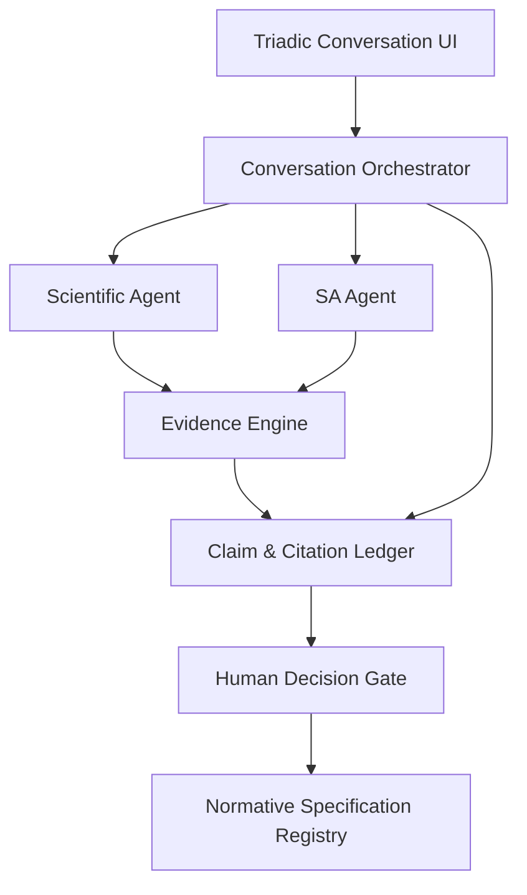
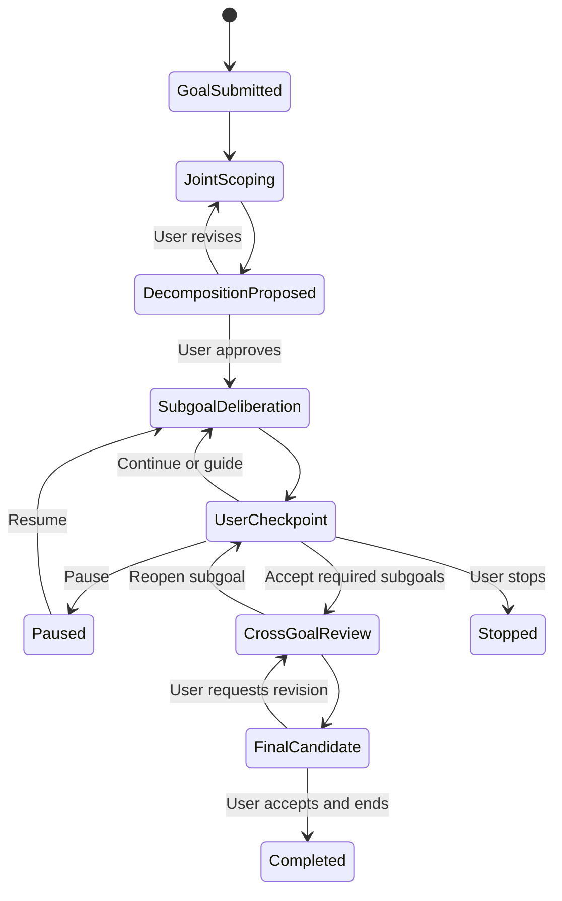

# MNEMOGRAPH TRIADIC RESEARCH WORKBENCH

## Project Charter & Working Agreement — Version 1.2

**Trạng thái:** Định hướng chính thức cho luồng làm việc hiện tại  
**Ngày hiệu lực:** 2026-07-16  
**Vai trò người dùng:** Người giám sát vòng lặp, SA đồng cấp, giám khảo và người quyết định điều kiện kết thúc  
**Vai trò AI trong luồng chat này:** Lead Systems Architect của hệ thống Research Workbench

---

## 1. Tuyên bố thay đổi mục tiêu

Từ thời điểm ban hành tài liệu này, luồng làm việc không tiếp tục thiết kế trực tiếp `Mnemograph_Core`.

Mục tiêu mới là nghiên cứu, thiết kế và phát triển một môi trường cộng tác ba bên có tên tạm thời:

> **Mnemograph Triadic Research Workbench**

Môi trường này cho phép ba chủ thể làm việc trực tiếp tại cùng một điểm:

1. **Người dùng/giám khảo:** đặt mục tiêu, quan sát toàn bộ quá trình tranh luận, can thiệp vào bất kỳ thời điểm nào và quyết định khi nào kết thúc.
2. **Scientific Agent — Nhà khoa học:** tổng hợp và lập luận dựa trên kho tài liệu khoa học thực tế.
3. **SA Agent — Kiến trúc sư hệ thống:** phản biện lý thuyết dưới góc độ ontology, dữ liệu, mô hình, tính nhân quả và khả năng triển khai.

Sản phẩm này là hạ tầng hỗ trợ xây dựng nền tảng lý thuyết cho Ma trận biến số toàn diện. Kiến trúc chi tiết của `Mnemograph_Core` chỉ được thực hiện sau khi lý thuyết đạt Architecture Readiness Gate.

---

## 2. Quyết định kiến trúc nền tảng

### 2.1. Xác nhận sử dụng hai AI role chuyên biệt qua API

Hệ thống sẽ có **hai dịch vụ reasoning AI độc lập ở cấp logic**, đều được gọi qua API:

| Dịch vụ | Role | Trách nhiệm chính |
|---|---|---|
| `ScientificModelService` | Nhà khoa học | Truy xuất bằng chứng, tổng hợp nghiên cứu, xây dựng và phản biện giả thuyết khoa học |
| `SAReviewModelService` | Systems Architect | Kiểm tra ontology, data flow, computational contract, model dependency và tác động kiến trúc |

Hai dịch vụ phải độc lập về:

- System prompt và role contract.
- Bộ công cụ được phép gọi.
- Nguồn context.
- Quyền truy cập dữ liệu.
- Output schema.
- Model/prompt version.
- Guardrails và tiêu chí đánh giá.

### 2.2. Hai AI role không đồng nghĩa bắt buộc dùng hai foundation model khác nhau

Trong MVP, hai dịch vụ có thể dùng cùng một foundation model thông qua hai endpoint hoặc hai cấu hình agent độc lập. Việc chọn hai model vật lý khác nhau, fine-tune riêng hoặc train model chuyên biệt chỉ được quyết định sau khi có benchmark.

Vì vậy, kiến trúc cam kết:

> **Hai chuyên gia AI độc lập ở cấp dịch vụ và hành vi; chưa khóa cứng nhà cung cấp hoặc foundation model.**

Ngoài hai reasoning roles trên, Evidence Engine có thể sử dụng embedding model, reranker, OCR hoặc entailment model. Đây là các model hạ tầng, không phải participant thứ tư trong cuộc hội thoại.

### 2.3. NotebookLM không nằm trong automated runtime

Do không có grounded-chat API phù hợp để tích hợp vào quy trình ba bên, NotebookLM không được xem là một plugin runtime của hệ thống.

NotebookLM có thể được nhà nghiên cứu sử dụng như công cụ hỗ trợ bên ngoài, nhưng:

- Không phải canonical source store.
- Không nằm trên critical path.
- Không được tự động phát hành claim chính thức.
- Output từ NotebookLM phải được tái xác minh qua Evidence Engine nếu muốn đi vào quy trình chuẩn.

Năng lực cần thiết của NotebookLM sẽ được tái tạo bằng một Scientific Agent có API và một Evidence Engine do hệ thống kiểm soát.

---

## 3. Mục tiêu hệ thống

### 3.1. Mục tiêu chính

- Cho phép người dùng thảo luận trực tiếp với cả Nhà khoa học và SA trong cùng một giao diện.
- Cho phép người dùng quan sát theo thời gian thực quá trình hai role đưa ra quan điểm, phản biện và điều chỉnh lẫn nhau.
- Cho phép người dùng bổ sung dữ kiện, sửa mục tiêu, đổi ưu tiên hoặc yêu cầu hai role xem xét lại ngay trong quá trình trao đổi.
- Phân rã mục tiêu lớn thành các mục tiêu nhỏ có phạm vi và điều kiện hoàn thành rõ ràng trước khi bắt đầu nghiên cứu sâu.
- Bảo đảm mọi scientific claim có thể truy nguyên tới nguồn và vị trí cụ thể.
- Tách biệt sự thật khoa học, suy luận khoa học, nhận định kiến trúc và quyết định thiết kế.
- Cho phép SA phản biện mà không biến engineering preference thành scientific fact.
- Quản lý bất đồng thay vì tự động hòa giải hai AI.
- Lưu vết đầy đủ từ giả thuyết tới quyết định và phiên bản phương án chính thức.
- Giảm tối đa thao tác copy/paste thủ công giữa các công cụ.
- Khi người dùng yêu cầu sau khi hoàn thành mục tiêu, xuất hai tài liệu kết luận độc lập: Scientific Rationale và Architecture Advisory.

### 3.2. Mục tiêu dài hạn

- Trở thành môi trường chuẩn để hoàn thiện Unified Matrix Theory.
- Tạo Research Traceability Matrix tự động.
- Phát hiện sớm model/training dependency.
- Hỗ trợ nhiều domain nghiên cứu ngoài Mnemograph mà không phụ thuộc một nhà cung cấp model.

---

## 4. Các nguyên tắc không được vi phạm

1. **Không có scientific claim nếu không có evidence hoặc nhãn `UNSUPPORTED`.**
2. **Không coi output của AI là nguồn khoa học.**
3. **Không trộn project reasoning vào scientific corpus.**
4. **Không cho bất kỳ model nào tự sửa normative specification.**
5. **Không coi sự đồng ý của hai AI là bằng chứng.**
6. **Không che giấu bất đồng giữa Nhà khoa học và SA.**
7. **Không khóa foundation model trước khi có benchmark.**
8. **Không sử dụng browser automation của NotebookLM làm nền tảng tích hợp.**
9. **Mọi quyết định normative đều cần human approval.**
10. **Mọi run phải lưu source version, model version và prompt version.**
11. **Hai AI role không được tự tuyên bố kết thúc mục tiêu tổng thể.**
12. **Người dùng là chủ thể quyết định tiếp tục, chấp nhận, mở lại, tạm dừng hoặc kết thúc.**
13. **Việc phân rã mục tiêu chỉ có hiệu lực sau khi người dùng phê duyệt.**
14. **Kết luận của một mục tiêu nhỏ không tự động trở thành kết luận chung của mục tiêu ban đầu.**
15. **Scientific Rationale chỉ được dùng nguồn khoa học làm bằng chứng.**
16. **Architecture Advisory phải coi phương án cuối đã được người dùng chấp nhận là theoretical baseline.**
17. **Hai tài liệu cuối không được thay thế hoặc giả mạo căn cứ của nhau.**
18. **Không được tuyên bố mức độ đúng đắn cao hơn mức mà evidence thực tế hỗ trợ.**

---

## 5. Kiến trúc logic



### 5.1. `Triadic Conversation UI`

Cung cấp một phòng thảo luận có ba danh tính tách biệt:

- User.
- Scientist.
- SA.

Giao diện phải hỗ trợ:

- `@scientist`: hỏi Nhà khoa học.
- `@sa`: hỏi SA.
- `@all`: mở roundtable.
- `@verify`: yêu cầu kiểm tra claim.
- `@decide`: mở cổng quyết định.
- `@guide`: bổ sung chỉ dẫn áp dụng ngay cho vòng trao đổi hiện tại.
- `@pause`: tạm dừng mà không làm mất trạng thái.
- `@resume`: tiếp tục phiên đã tạm dừng.
- `@stop`: kết thúc theo quyết định của người dùng.
- Evidence drawer.
- Claim cards.
- Disagreement panel.
- Goal decomposition tree.
- Subgoal progress và Definition of Done.
- Live deliberation timeline.
- Decision history.

### 5.2. `Conversation Orchestrator`

Điều phối thứ tự phát biểu, context, goal decomposition và checkpoint dành cho người dùng. Orchestrator phải phát trực tiếp từng phát biểu của hai role tới giao diện thay vì chỉ hiển thị bản tổng hợp cuối.

Orchestrator có thể áp dụng giới hạn mềm về số vòng, token, thời gian hoặc chi phí để cảnh báo và tạm dừng an toàn. Nó không được dùng giới hạn đó để tự tuyên bố mục tiêu đã hoàn thành. Khi đạt giới hạn, hệ thống phải yêu cầu người dùng quyết định tiếp tục, điều chỉnh hay kết thúc.

### 5.3. `Scientific Agent`

Scientific Agent chỉ được lập luận khoa học từ evidence passages do Evidence Engine trả về. Nếu không đủ bằng chứng, agent phải nói rõ `INSUFFICIENT_EVIDENCE`.

### 5.4. `SA Agent`

SA Agent đánh giá:

- Ontology và granularity.
- Input/output và state ownership.
- Causal order và label leakage.
- Observability và identifiability.
- Data requirements.
- Model/training dependency.
- Scalability, latency và khả năng vận hành.
- Tác động liên khối và migration risk.

### 5.5. `Evidence Engine`

Evidence Engine là nền dữ liệu dùng chung, bao gồm:

- Source Vault.
- Document parsing/OCR.
- Structured chunking.
- Hybrid retrieval.
- Reranking.
- Citation indexing.
- Claim-evidence verification.
- Counter-evidence retrieval.

### 5.6. `Human Decision Gate`

Chỉ người dùng hoặc hội đồng được ủy quyền mới có quyền:

- Accept/Revise/Reject/Defer một giả thuyết.
- Chấp nhận thay đổi normative.
- Phát hành version mới.
- Mở lại một quyết định cũ.

---

## 6. Phân vùng dữ liệu

### 6.1. Scientific Corpus

Chỉ chứa nguồn khoa học và tài liệu kỹ thuật có xuất xứ xác định.

### 6.2. Project Reasoning Corpus

Chứa giả thuyết, transcript, Research Package, SA Review và open questions. Vùng này không được dùng như scientific evidence.

### 6.3. Normative Corpus

Chứa tài liệu chính thức đã được phê duyệt và version hóa.

---

## 7. Hợp đồng nhận thức của hai AI role

### 7.1. Scientific Agent contract

Scientific Agent phải:

- Dùng nguồn trong phạm vi được cấp.
- Tách claim thành các phát biểu độc lập.
- Cung cấp supporting evidence và counter-evidence.
- Nêu điều kiện áp dụng, limitation và confidence.
- Phân biệt correlation, causation và inference.
- Từ chối kết luận khi evidence không đủ.

Scientific Agent không được:

- Quyết định kiến trúc.
- Dùng project notes làm scientific proof.
- Tạo nguồn hoặc citation không tồn tại.
- Tự nâng giả thuyết thành chuẩn.

### 7.2. SA Agent contract

SA Agent phải:

- Liên kết review với `claim_id`.
- Ghi rõ đâu là evidence-backed observation và đâu là engineering inference.
- Chuyển nghi vấn khoa học thành research question trả lại Scientific Agent.
- Phân loại cơ chế thành calculation, calibration, pretrained, fine-tune, custom-train hoặc policy.
- Đánh giá tác động tới toàn hệ thống.

SA Agent không được:

- Bác bỏ khoa học chỉ vì khó triển khai.
- Trình bày design preference như scientific fact.
- Tự sửa công thức chính thức.
- Tự phê duyệt kiến nghị của mình.

---

## 8. Giao thức thảo luận có người dùng giám sát

### 8.1. Khởi tạo và phân rã mục tiêu

Khi người dùng cung cấp mục tiêu ban đầu, hệ thống chưa bắt đầu nghiên cứu sâu ngay. Hai role phải thực hiện một phiên `Joint Scoping`:

1. Scientific Agent phân tích các câu hỏi khoa học, vùng bằng chứng và dependency nghiên cứu.
2. SA Agent phân tích phạm vi hệ thống, dependency kiến trúc, dữ liệu và model.
3. Hai role phản biện cách phân rã của nhau.
4. Orchestrator tạo `GoalDecompositionProposal` gồm các mục tiêu nhỏ, thứ tự, dependency, output và Definition of Done.
5. Người dùng xem, chỉnh sửa, gộp, tách, đổi thứ tự hoặc bác bỏ đề xuất.
6. Chỉ kế hoạch đã được người dùng phê duyệt mới trở thành `ApprovedGoalPlan`.

Hai role có trách nhiệm đề xuất có nên chia nhỏ mục tiêu, nhưng không được tự ý áp dụng cách chia đó.

### 8.2. Vòng thảo luận cho từng mục tiêu nhỏ

Mỗi `Subgoal` chạy trong một vòng lặp độc lập:

1. Scientific Agent đưa ra quan điểm dựa trên evidence.
2. SA Agent kiểm tra claim và phản biện tác động hệ thống.
3. Scientific Agent trả lời challenge, bổ sung hoặc thu hẹp kết luận.
4. SA Agent điều chỉnh kiến nghị và nêu unresolved risks.
5. Orchestrator phát `UserCheckpoint` cùng trạng thái hiện tại.
6. Người dùng lựa chọn một hành động:
   - `CONTINUE`: cho phép thêm một vòng phản biện.
   - `GUIDE`: bổ sung ý kiến hoặc điều chỉnh hướng nghiên cứu.
   - `REVISE_SCOPE`: sửa phạm vi mục tiêu nhỏ.
   - `ACCEPT_SUBGOAL`: chấp nhận kết luận tạm thời.
   - `REOPEN`: mở lại một kết luận đã chấp nhận.
   - `PAUSE`: tạm dừng và bảo toàn trạng thái.
   - `STOP`: kết thúc phiên theo quyết định của người dùng.

Hai role được phép trao đổi nhiều vòng. Không role nào có quyền đơn phương kết thúc vòng lặp.

### 8.3. Chống vòng lặp vô tận

Hệ thống kiểm soát vòng lặp bằng phạm vi thay vì tự động ép hội thoại kết thúc:

- Mỗi vòng chỉ xử lý một `Subgoal`.
- Mỗi `Subgoal` có Definition of Done và danh sách open questions.
- Mỗi phát biểu mới phải bổ sung evidence, phản biện một claim cụ thể hoặc làm thay đổi một decision option.
- Orchestrator phát hiện lặp lại nội dung và cảnh báo `NO_NEW_INFORMATION`.
- Giới hạn tài nguyên chỉ làm phiên chuyển sang `AWAITING_USER`, không tự động tạo kết luận.
- Người dùng giữ quyền kéo dài vòng thảo luận nếu thấy cần thiết.

### 8.4. Tổng hợp mục tiêu ban đầu

Sau khi các mục tiêu nhỏ cần thiết được người dùng chấp nhận:

1. Scientific Agent kiểm tra tính nhất quán khoa học giữa các kết luận nhỏ.
2. SA Agent thực hiện cross-subgoal architecture consistency review.
3. Hai role công khai các xung đột còn lại và đề xuất phương án xử lý.
4. Hệ thống tạo `FinalCandidateResult`, không phải kết luận tự động.
5. Người dùng có thể chấp nhận, yêu cầu sửa, mở lại bất kỳ subgoal nào hoặc kết thúc mà không phát hành normative result.

Điều kiện kết thúc cuối cùng luôn do người dùng xác lập.

### 8.5. State machine điều phối mục tiêu



### 8.6. Dual-Deliverable Publication Gate

Khi mục tiêu ban đầu đã đạt điều kiện hoàn thành do người dùng xác lập, hệ thống tạo một `FinalCandidateResult`. Chỉ sau khi người dùng chấp nhận kết quả này, hệ thống mới đóng băng nó thành `FinalAcceptedProposal`.

Việc hoàn thành thảo luận không tự động sinh tài liệu. Người dùng phải chủ động gọi `@publish` hoặc yêu cầu xuất tài liệu. Khi đó, hệ thống tạo hai deliverables tách biệt.

#### Deliverable A — Scientific Rationale Document

**Chủ thể chịu trách nhiệm:** Scientific Agent  
**Mục tiêu:** Xây dựng tài liệu lý luận khoa học cho phương án cuối cùng đã được chấp nhận.

Nguồn đầu vào được phép:

- Scientific Corpus đã đóng băng theo `evidence_snapshot_id`.
- Verified claims và counter-evidence.
- Các công thức, giả định và giới hạn đã được người dùng chấp nhận trong `FinalAcceptedProposal`.

Nguồn không được dùng làm bằng chứng khoa học:

- Ý kiến của SA.
- Lựa chọn công nghệ.
- Transcript hội thoại.
- Quyết định của người dùng.
- Project notes hoặc output của AI.

Tài liệu phải bao gồm tối thiểu:

1. Mục tiêu và phạm vi nghiên cứu.
2. Phương án cuối cùng cần lập luận.
3. Ontology và định nghĩa thuật ngữ.
4. Phương pháp lựa chọn và đánh giá nguồn.
5. Các scientific claims kèm citation locator.
6. Chuỗi lập luận từ bằng chứng tới phương án.
7. Công thức hoặc mô hình lý thuyết liên quan.
8. Counter-evidence và cách xử lý.
9. Điều kiện áp dụng.
10. Mức độ tin cậy, limitation và open questions.
11. Các phương án đã bị bác bỏ hoặc sửa đổi.
12. Kết luận khoa học.

Scientific Agent không được tuyên bố phương án đã được “chứng minh tuyệt đối” nếu nguồn chỉ cung cấp bằng chứng gián tiếp, tương quan, giới hạn theo population hoặc chưa có thực nghiệm trực tiếp. Khi đó phải sử dụng các mức kết luận như `SUPPORTED`, `CONDITIONALLY_SUPPORTED`, `PARTIALLY_SUPPORTED` hoặc `INSUFFICIENT_EVIDENCE`.

#### Deliverable B — Architecture Advisory Document

**Chủ thể chịu trách nhiệm:** SA Agent  
**Mục tiêu:** Chuyển phương án cuối cùng đã được chấp nhận thành tư vấn thiết kế kiến trúc có khả năng triển khai.

Nguồn đầu vào chính:

- `FinalAcceptedProposal` như theoretical baseline bắt buộc.
- Scientific Rationale Document để truy nguyên cơ sở khoa học, không dùng thay cho requirement.
- Project constraints và non-functional requirements do người dùng xác nhận.
- Model Dependency Register, Architecture Decision Records và các risk records.

SA không được tự ý sửa hoặc bác bỏ theoretical baseline trong tài liệu tư vấn. Nếu phát hiện baseline không thể triển khai, SA phải ghi thành `Architecture Blocker` hoặc `Research Reopen Request` để người dùng quyết định mở lại quá trình nghiên cứu.

Tài liệu phải bao gồm tối thiểu:

1. Executive summary.
2. Theoretical baseline và version tham chiếu.
3. Scope và non-goals.
4. Architecture drivers.
5. Assumptions, invariants và constraints.
6. Logical architecture và component boundaries.
7. Data architecture và state ownership.
8. Agent/model architecture và API contracts.
9. Thành phần calculation, calibration, pretrained, fine-tune và custom-train.
10. Workflow, causal ordering và consistency model.
11. Security, privacy, provenance, audit và versioning.
12. Scalability, latency, availability và cost considerations.
13. Trade-offs và Architecture Decision Records.
14. Risks, blockers và open issues.
15. Implementation roadmap và validation strategy.
16. Traceability từ accepted claims tới architecture components.

#### Tính độc lập và liên kết phiên bản

Hai tài liệu phải được version hóa và liên kết bằng:

- `goal_id`.
- `approved_goal_plan_version`.
- `final_accepted_proposal_version`.
- `evidence_snapshot_id`.
- `scientific_rationale_version`.
- `architecture_advisory_version`.
- `generated_by_model_version` và `prompt_version`.

Scientific Rationale là căn cứ khoa học. Architecture Advisory là tư vấn triển khai. Hai tài liệu tạo thành một bộ kết luận nhưng không được gộp thành một tiếng nói duy nhất.

#### Review và phát hành

1. Hai agent tạo bản nháp độc lập.
2. Hệ thống chạy citation/provenance validation cho Scientific Rationale.
3. Hệ thống chạy theoretical-traceability validation cho Architecture Advisory.
4. Người dùng xem và yêu cầu sửa từng tài liệu độc lập.
5. Chỉ người dùng mới được phê duyệt bản phát hành cuối.

---

## 9. Loại phát biểu chuẩn

Mỗi phát biểu phải mang một nhãn:

| Nhãn | Ý nghĩa |
|---|---|
| `EVIDENCE_SUPPORTED` | Được nguồn hỗ trợ trực tiếp |
| `EVIDENCE_CONTRADICTED` | Có nguồn phản bác |
| `SCIENTIFIC_INFERENCE` | Suy luận khoa học từ bằng chứng |
| `ENGINEERING_INFERENCE` | Nhận định khả thi hệ thống |
| `DESIGN_PROPOSAL` | Kiến nghị thiết kế |
| `DESIGN_DECISION` | Quyết định đã được người có thẩm quyền chấp thuận |
| `OPEN_HYPOTHESIS` | Giả thuyết chưa đủ bằng chứng |
| `INSUFFICIENT_EVIDENCE` | Không đủ bằng chứng để kết luận |
| `OUT_OF_SCOPE` | Ngoài phạm vi hiện tại |

---

## 10. Model strategy

### 10.1. Model abstraction

Mọi model provider phải nằm sau interface nội bộ. Domain workflow không được phụ thuộc trực tiếp vào tên model hoặc nhà cung cấp.

### 10.2. Model selection stages

1. Chọn model ứng viên thông qua API.
2. Xây benchmark riêng cho Scientific role và SA role.
3. Đo grounding, citation fidelity, reasoning quality, latency và cost.
4. Quyết định dùng cùng base model hay hai model khác nhau.
5. Chỉ fine-tune khi prompting, retrieval và tool use chưa đạt tiêu chí.
6. Chỉ train model riêng khi có dataset, label và lợi ích được chứng minh.

### 10.3. Minimum model requirements

Scientific role cần ưu tiên:

- Grounded synthesis.
- Citation discipline.
- Xử lý paper và công thức.
- Nhận biết giới hạn bằng chứng.

SA role cần ưu tiên:

- Systems reasoning.
- Dependency analysis.
- Data/model architecture.
- Risk and consistency review.
- Structured output ổn định.

---

## 11. Phạm vi MVP

MVP phải chứng minh được vertical slice sau:

```text
Source ingestion
→ User submits an initial goal
→ Scientist and SA propose goal decomposition
→ User approves or revises the plan
→ Supervised deliberation for each subgoal
→ User checkpoints and interventions
→ Cross-subgoal consistency review
→ User-controlled final decision
→ User requests dual publication
→ Scientific Rationale + Architecture Advisory
→ Traceability record
```

MVP chưa cần:

- Fine-tuned models.
- Custom-trained LLM.
- Multi-tenant enterprise scale.
- Tự động phát hành normative spec không có human approval.
- Training pipeline cho `Mnemograph_Core`.

---

## 12. Tiêu chí nghiệm thu MVP

- Người dùng trao đổi với cả hai roles trong một UI mà không copy/paste.
- Người dùng quan sát được từng lượt Scientist–SA phản biện thay vì chỉ nhận bản kết luận tổng hợp.
- Người dùng có thể can thiệp, đổi hướng, tạm dừng và tiếp tục mà không mất trạng thái.
- Hai role đề xuất được goal decomposition và chỉ thực thi sau khi người dùng phê duyệt.
- Mỗi subgoal có trạng thái, Definition of Done và kết luận riêng.
- Không role nào có thể tự kết thúc mục tiêu tổng thể.
- Chỉ sinh hai tài liệu kết luận khi người dùng yêu cầu sau khi chấp nhận `FinalAcceptedProposal`.
- Scientific Rationale không chứa SA opinion như bằng chứng khoa học.
- Architecture Advisory truy nguyên được mọi quyết định quan trọng về theoretical baseline.
- Hai tài liệu có version linkage và được người dùng phê duyệt độc lập.
- Hai roles được hiển thị và lưu vết độc lập.
- Scientific claim có citation locator hoặc nhãn `INSUFFICIENT_EVIDENCE`.
- SA review liên kết được với claim gốc.
- Scientific fact và engineering inference không bị trộn.
- Bất đồng được hiển thị rõ.
- Human decision là điều kiện bắt buộc để cập nhật normative corpus.
- Mọi run lưu model, prompt, source và workflow version.
- Có thể replay một phiên review từ dữ liệu đã lưu.

---

## 13. Các giai đoạn phát triển

### Phase 0 — Governance & Contracts

- Goal, Subgoal và decomposition schema.
- Deliberation lifecycle và UserCheckpoint schema.
- Variable/claim ontology.
- Source quality policy.
- Research Package schema.
- SA Review schema.
- Human Decision Record.
- Model role contracts.

### Phase 1 — Evidence Vertical Slice

- Source ingestion.
- Citation-aware retrieval.
- Scientific Agent API.
- Claim Ledger.

### Phase 2 — Triadic Conversation

- SA Agent API.
- Conversation Orchestrator.
- `@scientist`, `@sa`, `@all`.
- Disagreement handling.

### Phase 3 — Governance & Publication

- Evidence audit.
- Human gate.
- Traceability Matrix.
- Normative versioning.
- FinalAcceptedProposal freeze.
- Scientific Rationale generator và citation validation.
- Architecture Advisory generator và theoretical-traceability validation.
- Dual-document review và publication workflow.

### Phase 4 — Evaluation & Hardening

- Model benchmark.
- Security and access control.
- Cost/latency optimization.
- Provider fallback.
- Audit and replay testing.

---

## 14. Pilot đầu tiên

Pilot đề xuất là giả thuyết `R — Recency Penalty`:

> Có cần một biến `R` độc lập để hạn chế massed practice, hay cơ chế này nên được biểu diễn bằng scheduling policy hoặc được hấp thụ vào một cơ chế trí nhớ khác?

Pilot phải đi qua đầy đủ vòng:

1. Scientific evidence retrieval.
2. Claim generation.
3. SA architecture review.
4. Counter-evidence challenge.
5. Human decision hoặc defer.
6. Research Traceability record.

---

## 15. Quy ước làm việc cho luồng chat hiện tại

Từ thời điểm này, các trao đổi trong luồng chat ưu tiên các mục tiêu:

1. Hoàn thiện charter và requirement của Research Workbench.
2. Thiết kế data contracts và agent contracts.
3. Thiết kế Evidence Engine.
4. Thiết kế giao thức hội thoại ba bên.
5. Lập kế hoạch MVP và benchmark hai AI roles.
6. Sau khi kiến trúc được chốt, triển khai từng module và kiểm thử vertical slice.

Mọi yêu cầu quay lại thiết kế `Mnemograph_Core` phải được xem là một luồng riêng hoặc một quyết định thay đổi phạm vi có chủ ý.

---

## 16. Quyết định đã được xác nhận

| ID | Quyết định | Trạng thái |
|---|---|---|
| `DEC-001` | Chuyển mục tiêu luồng chat sang phát triển Triadic Research Workbench | Accepted |
| `DEC-002` | Dùng hai AI reasoning roles chuyên biệt qua API | Accepted |
| `DEC-003` | Chưa bắt buộc hai foundation model khác nhau | Accepted |
| `DEC-004` | NotebookLM không nằm trong automated runtime | Accepted |
| `DEC-005` | Evidence Engine là nền dữ liệu dùng chung cho Scientist và SA | Accepted |
| `DEC-006` | Human approval bắt buộc trước mọi thay đổi normative | Accepted |
| `DEC-007` | Người dùng giám sát trực tiếp và có thể can thiệp vào mọi vòng thảo luận | Accepted |
| `DEC-008` | Hai role phải đề xuất phân rã mục tiêu trước khi xử lý mục tiêu lớn | Accepted |
| `DEC-009` | Chỉ người dùng quyết định điều kiện kết thúc phiên và mục tiêu tổng thể | Accepted |
| `DEC-010` | Vòng lặp được giới hạn bằng subgoal, checkpoint và cảnh báo tài nguyên; không tự động kết luận | Accepted |
| `DEC-011` | Sau khi chấp nhận kết quả, người dùng có thể yêu cầu hai tài liệu kết luận độc lập | Accepted |
| `DEC-012` | Scientific Rationale chỉ sử dụng Scientific Corpus làm nguồn bằng chứng | Accepted |
| `DEC-013` | Architecture Advisory sử dụng FinalAcceptedProposal làm theoretical baseline | Accepted |
| `DEC-014` | Hai tài liệu được version hóa, kiểm tra và phê duyệt độc lập | Accepted |

---

## 17. Bước tiếp theo

Thiết kế và chốt năm nhóm hợp đồng đầu tiên:

1. `Goal`, `GoalDecompositionProposal`, `ApprovedGoalPlan` và `Subgoal`.
2. `DeliberationTurn`, `UserIntervention` và `UserCheckpoint`.
3. `SourceManifest` và `EvidencePassage`.
4. `ScientificResearchResponse`, `Claim`, `SAReviewResponse` và `ArchitectureIssue`.
5. `FinalAcceptedProposal`, `ScientificRationaleDocument` và `ArchitectureAdvisoryDocument`.

Sau đó mới lựa chọn stack công nghệ và model API ứng viên cho MVP.