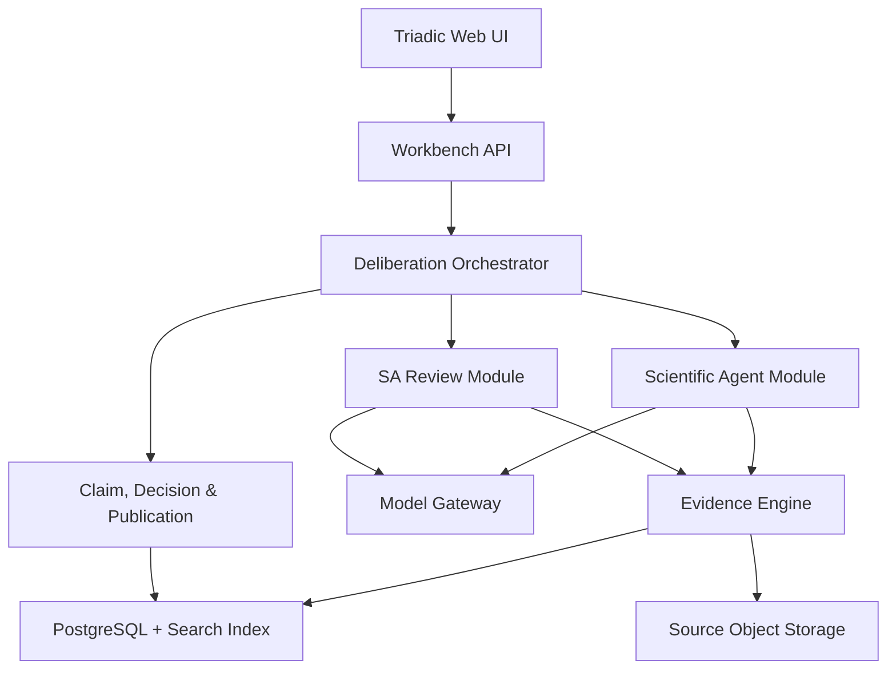
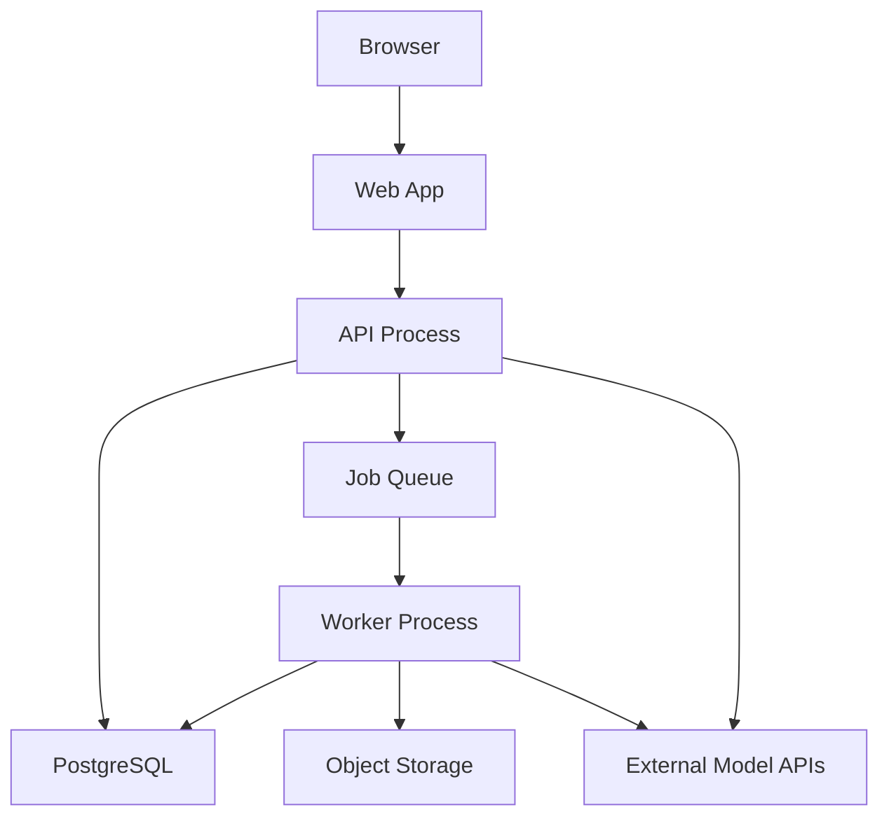
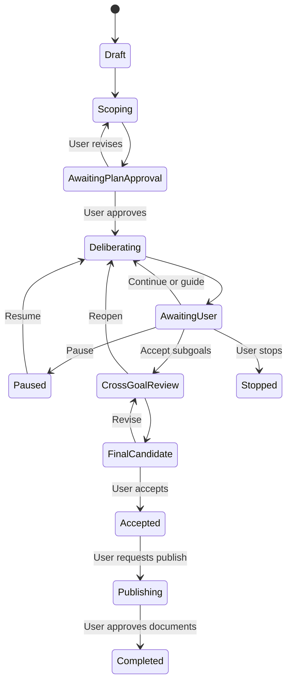

# MNEMOGRAPH TRIADIC RESEARCH WORKBENCH

## System Design & Copilot Delivery Architecture — Version 0.1

**Trạng thái:** Accepted architecture baseline  
**Ngày:** 2026-07-16  
**Ngày phê duyệt:** 2026-07-16  
**Nguồn định hướng:** Project Charter v1.2  
**Mục đích:** Baseline được phê duyệt để triển khai bằng GitHub Copilot theo các phase và cổng kiểm soát trong tài liệu

---

## 1. Executive decision

### 1.1. Kiến trúc sản phẩm

MVP được xây dựng dưới dạng **modular monolith có worker riêng**, gồm:

- Web application cho cuộc thảo luận ba bên.
- Backend API và durable deliberation orchestrator.
- Background worker cho ingest, retrieval, verification và document generation.
- PostgreSQL làm transactional source of truth.
- Vector/full-text index cho Evidence Engine.
- Object storage cho source snapshots.
- Hai reasoning model services được gọi qua API: Scientist và SA.

Logical modules được tách rõ ngay từ đầu nhưng chưa triển khai thành nhiều microservice độc lập.

### 1.2. Công cụ triển khai bằng GitHub Copilot

**Quyết định đã phê duyệt `ADR-DEV-001`:**

> Dùng **VS Code GitHub Copilot Chat/Agent Mode làm bề mặt phát triển chính**. Dùng GitHub Copilot CLI như bề mặt phụ cho lập kế hoạch, terminal-heavy tasks, validation và automation có kiểm soát.

Không sử dụng Copilot CLI Autopilot trong các phase xây dựng foundation, workflow state machine, evidence provenance và security boundary.

---

## 2. Bối cảnh và giả định

### 2.1. Giả định MVP

- Một người dùng hoặc một nhóm nghiên cứu nhỏ.
- Người dùng tương tác qua web browser.
- Scientist và SA sử dụng model API; chưa tự host foundation model.
- Tài liệu đầu vào chủ yếu là PDF, Markdown, DOCX, webpage snapshot và metadata học thuật.
- Mọi thay đổi normative đều cần người dùng phê duyệt.
- Discussion loop có thể tạm dừng và tiếp tục sau nhiều phiên làm việc.
- Hệ thống phải replay được lịch sử deliberation.
- Chưa yêu cầu multi-region hoặc enterprise multi-tenancy.

### 2.2. Các thuộc tính chất lượng quan trọng nhất

1. Traceability.
2. Human control.
3. Evidence provenance.
4. Role isolation.
5. Replayability.
6. Auditability.
7. Provider portability.
8. Recoverability.
9. Security against untrusted documents.
10. Chi phí vận hành có thể quan sát.

---

## 3. Logical architecture



### 3.1. Deployment view cho MVP



Các deployment units ban đầu:

| Unit | Trách nhiệm |
|---|---|
| `web` | UI, streaming timeline, evidence drawer, user controls |
| `api` | REST/SSE endpoints, auth, command validation, orchestration |
| `worker` | Ingest, retrieval jobs, verification, publication generation |
| `postgres` | State, events, claims, decisions, metadata, vector/full-text index |
| `object-store` | Immutable source files và generated artifacts |
| `queue` | Background jobs và retry isolation |

---

## 4. Bounded modules

### 4.1. Identity & Access

- User identity.
- Workspace membership.
- Role-based authorization.
- API key/secret references.
- Publication authority.

### 4.2. Goal Management

Sở hữu:

- `Goal`.
- `GoalDecompositionProposal`.
- `ApprovedGoalPlan`.
- `Subgoal`.
- Goal version và dependency graph.

### 4.3. Deliberation

Sở hữu:

- `DeliberationSession`.
- `DeliberationTurn`.
- `UserIntervention`.
- `UserCheckpoint`.
- `FinalCandidateResult`.
- Pause/resume/stop state.

### 4.4. Evidence

Sở hữu:

- `SourceManifest`.
- `SourceSnapshot`.
- `DocumentStructure`.
- `EvidencePassage`.
- Retrieval run.
- Citation locator và excerpt hash.
- Source quality metadata.

### 4.5. Scientific Reasoning

Sở hữu:

- Scientific prompt assembly.
- Research query decomposition.
- `ScientificResearchResponse`.
- Draft `Claim`.
- Scientific confidence và limitations.

Không sở hữu source files, accepted claims hoặc normative decisions.

### 4.6. Architecture Review

Sở hữu:

- `SAReviewResponse`.
- `ArchitectureIssue`.
- `ArchitectureBlocker`.
- `ResearchReopenRequest`.
- Model dependency classification.

### 4.7. Claim & Citation Governance

Sở hữu:

- `Claim` lifecycle.
- `EvidenceLink`.
- Support/contradiction status.
- Citation validation result.
- Counter-evidence association.

### 4.8. Decision & Normative Governance

Sở hữu:

- Human decisions.
- Accepted/rejected/deferred status.
- `FinalAcceptedProposal`.
- Normative version references.

### 4.9. Publication

Sở hữu:

- `ScientificRationaleDocument`.
- `ArchitectureAdvisoryDocument`.
- Publication job.
- Artifact validation.
- Document version linkage.

### 4.10. Model Gateway

Cung cấp provider-neutral API cho:

- Scientist reasoning call.
- SA reasoning call.
- Embedding.
- Reranking.
- Optional entailment/citation verification.

Model Gateway chịu trách nhiệm timeout, retry, idempotency, token/cost accounting và model version capture.

### 4.11. Audit & Observability

- Append-only audit log.
- Prompt/template version.
- Model/provider version.
- Source/evidence snapshot.
- Workflow transition.
- Cost, latency và error metrics.

---

## 5. Deliberation orchestration

### 5.1. Nguyên tắc

- Scientist và SA không gọi trực tiếp lẫn nhau.
- Mọi turn đi qua Orchestrator.
- Mọi turn được persist trước khi turn tiếp theo bắt đầu.
- User intervention có priority cao hơn queued agent turns.
- Mọi workflow transition sử dụng optimistic concurrency/version check.
- Model timeout không được hiểu là agent đồng ý hoặc mục tiêu hoàn thành.

### 5.2. Goal workflow



### 5.3. Discussion execution modes

| Mode | Hành vi |
|---|---|
| `STEP` | Chạy một agent turn rồi chờ người dùng |
| `ROUND` | Chạy Scientist → SA → Scientist response → SA synthesis rồi checkpoint |
| `SUPERVISED_AUTO` | Tự chạy nhiều round trong soft budget; người dùng có thể steer/pause bất kỳ lúc nào |

MVP ưu tiên `ROUND`. `SUPERVISED_AUTO` chỉ bật sau khi interruption, audit và budget controls đã được kiểm thử.

### 5.4. User intervention semantics

- `GUIDE`: thêm constraint cho các turn sau; không sửa transcript cũ.
- `CORRECT_CONTEXT`: bổ sung hoặc thay thế dữ kiện dự án.
- `REVISE_SCOPE`: tạo version mới của subgoal.
- `PAUSE`: dừng scheduling turn mới.
- `STOP`: kết thúc session nhưng không tự tạo accepted result.
- `REOPEN`: tạo branch deliberation mới từ checkpoint đã chọn.

---

## 6. Evidence Engine

### 6.1. Ingestion pipeline

```text
Upload/Register source
→ Malware/type validation
→ Immutable snapshot
→ Parse/OCR
→ Structural segmentation
→ Metadata enrichment
→ Embedding/full-text indexing
→ Quality review
→ Ready for retrieval
```

### 6.2. Structural chunking

Evidence passage phải bảo toàn:

- Source ID và version.
- Page/section/paragraph.
- Heading hierarchy.
- Equation/table/figure association.
- Character offsets hoặc stable locator.
- Excerpt hash.

### 6.3. Retrieval pipeline

1. Query decomposition.
2. Metadata/source-quality filtering.
3. Full-text retrieval.
4. Vector retrieval.
5. Merge và deduplicate.
6. Rerank.
7. Passage context expansion.
8. Retrieval run persistence.

### 6.4. Citation validation

Một scientific claim chỉ đạt `EVIDENCE_SUPPORTED` khi:

- Locator tồn tại trong đúng source version.
- Trích đoạn không bị thay đổi.
- Claim không vượt quá phạm vi evidence.
- Source quality và population/task context được ghi nhận.
- Counter-evidence search đã được thực hiện theo policy.

### 6.5. Prompt injection boundary

Tài liệu được xem là untrusted input. Parser và prompt assembler phải:

- Tách content khỏi system/developer instructions.
- Không thực thi lệnh nằm trong tài liệu.
- Không truyền secrets vào model context.
- Ghi rõ source text chỉ là bằng chứng để phân tích.
- Chặn URL/file tool calls không nằm trong allowlist.

---

## 7. Agent architecture

### 7.1. Scientific Agent tool scope

Được phép:

- Search/read Scientific Corpus.
- Yêu cầu counter-evidence retrieval.
- Đọc hypothesis, goal và accepted project definitions.
- Tạo draft claims và research questions.

Không được phép:

- Ghi normative decisions.
- Đọc secrets.
- Tự publish.
- Chạy shell/database mutation.

### 7.2. SA Agent tool scope

Được phép:

- Đọc claims, evidence, project constraints và theory versions.
- Đọc architecture decision history.
- Tạo issues, blockers, options và reopen requests.
- Yêu cầu Scientific Agent trả lời một research question thông qua Orchestrator.

Không được phép:

- Sửa scientific evidence.
- Chấp nhận claim.
- Tự publish.
- Chạy infrastructure mutation.

### 7.3. Structured outputs

Model output không được persist như domain entity trước khi:

1. Parse đúng schema.
2. Validate enum/range/reference.
3. Kiểm tra referenced IDs tồn tại.
4. Gắn model/prompt/run version.
5. Chuyển thành draft state.

---

## 8. Data architecture

### 8.1. Transactional source of truth

PostgreSQL lưu:

- Users/workspaces.
- Goals/plans/subgoals.
- Sessions/turns/interventions/checkpoints.
- Source metadata và locators.
- Claims/evidence links/reviews.
- Decisions/normative versions.
- Publication metadata.
- Audit events.

### 8.2. Object storage

Lưu:

- Original source snapshot.
- Parsed structured document.
- Generated document artifacts.
- Optional OCR/layout artifacts.

Object keys phải immutable theo version.

### 8.3. Search

MVP dùng PostgreSQL full-text search kết hợp vector extension để giảm vận hành. Khi corpus và throughput vượt ngưỡng đo được mới tách sang search engine chuyên dụng.

### 8.4. Event and audit model

Không triển khai full event sourcing cho toàn hệ thống trong MVP. Thay vào đó:

- Domain state lưu dạng bảng hiện hành.
- Mọi transition quan trọng ghi append-only `audit_event`.
- Deliberation turns và user interventions là immutable records.
- Snapshot/version được dùng để replay workflow và model context.

---

## 9. API architecture

### 9.1. Synchronous API

REST cho command/query có thời lượng ngắn:

- Create/update goal.
- Approve decomposition.
- Submit intervention.
- Pause/resume/stop.
- Accept/reopen subgoal.
- Request publication.
- Read claims/evidence/decisions.

### 9.2. Streaming

Server-Sent Events được ưu tiên cho MVP để stream:

- Agent tokens hoặc message chunks.
- Turn state.
- Retrieval progress.
- User checkpoint.
- Publication progress.

WebSocket chỉ được thêm nếu cần bidirectional low-latency vượt quá REST + SSE.

### 9.3. Background jobs

Các tác vụ sau chạy qua queue:

- Document ingest/OCR/index.
- Long retrieval/verification.
- Agent turns có thời lượng dài.
- Counter-evidence sweep.
- Final document generation.

Job phải idempotent và có retry policy theo error class.

---

## 10. Technology baseline đề xuất

| Layer | Baseline |
|---|---|
| Web | TypeScript + React/Next.js |
| API | Python + FastAPI + Pydantic |
| Worker | Python worker cùng domain packages |
| Database | PostgreSQL + vector/full-text support |
| Queue | Redis-compatible queue cho MVP |
| Object storage | S3-compatible storage |
| Streaming | SSE |
| Contracts | OpenAPI + JSON Schema |
| Testing backend | pytest |
| Testing frontend | unit/component tests + Playwright E2E |
| Packaging/development | Docker Compose |
| Observability | Structured logs + OpenTelemetry-compatible instrumentation |

### 10.1. Lý do chọn Python backend

- Hệ sinh thái document processing, RAG, evaluation và model API phong phú.
- Pydantic phù hợp structured model outputs và API contracts.
- Dễ xây worker dùng chung domain contracts với API.

### 10.2. Lý do chọn modular monolith

- Workflow và invariants còn thay đổi.
- Transaction boundaries giữa goal, deliberation, claim và decision cần rõ trước khi phân tán.
- Dễ debug và replay trong MVP.
- Giảm chi phí vận hành.
- Logical ports cho phép tách module thành service sau này.

---

## 11. Repository architecture

```text
/
├── apps/
│   ├── web/
│   ├── api/
│   └── worker/
├── libs/
│   ├── contracts/
│   ├── domain/
│   ├── prompts/
│   ├── model_gateway/
│   └── evaluation/
├── docs/
│   ├── architecture/
│   ├── adr/
│   ├── requirements/
│   └── runbooks/
├── tests/
│   ├── contract/
│   ├── integration/
│   ├── e2e/
│   └── golden/
├── infra/
│   ├── compose/
│   └── migrations/
├── .github/
│   ├── agents/
│   ├── instructions/
│   ├── prompts/
│   ├── workflows/
│   └── copilot-instructions.md
└── AGENTS.md
```

### 11.1. Dependency rules

- `domain` không import web framework, database client hoặc model SDK.
- `api` và `worker` dùng domain/application ports.
- `model_gateway` không chứa domain decisions.
- `prompts` được version hóa và test như source code.
- `web` chỉ dùng published API contracts.
- `publication` không được gọi model mà không đi qua Model Gateway.

---

## 12. GitHub Copilot delivery design

### 12.1. Quyết định IDE Chat hay CLI

| Tiêu chí | VS Code Copilot Chat/Agent | Copilot CLI |
|---|---|---|
| Review diff trực quan | Rất phù hợp | Hạn chế hơn |
| Keep/undo từng edit | Có | Chủ yếu qua diff/rewind |
| Checkpoint/rollback | Tích hợp trong editor | Có rewind session |
| Steer khi agent đang chạy | Có | Có |
| Debug/test integration | Mạnh | Terminal-centric |
| Parallel sessions | Quản lý trực quan | Nhiều terminal/session |
| Custom agents/instructions | Có | Có |
| MCP/tools | Có | Có |
| Scriptable/headless prompts | Hạn chế | Mạnh |
| Autopilot | Không phải ưu tiên chính | Mạnh nhưng rủi ro cao hơn |
| Phù hợp foundation phase | **Cao** | Trung bình |
| Phù hợp batch automation sau này | Trung bình | **Cao** |

VS Code cho phép steer/queue message trong khi agent đang chạy, review inline diff và sử dụng checkpoints để rollback. Đây là các khả năng phù hợp với dự án cần human supervision. [VS Code agent documentation](https://code.visualstudio.com/docs/copilot/chat/chat-agent-mode)

Copilot CLI có Plan mode, custom agents, MCP, permission controls và Autopilot. Đây là công cụ mạnh cho terminal workflows, nhưng Autopilot cấp quyền rộng và chạy không dừng để hỏi người dùng nên không phù hợp foundation phase. [Copilot CLI overview](https://docs.github.com/copilot/concepts/agents/about-copilot-cli), [Autopilot documentation](https://docs.github.com/en/copilot/concepts/agents/copilot-cli/autopilot)

### 12.2. Quyết định sử dụng

**Primary:** VS Code Copilot Chat — Plan/Agent mode.  
**Secondary:** Copilot CLI trong integrated terminal.  
**Deferred:** CLI Autopilot và cloud coding agent cho tới khi test/guardrail đủ mạnh.

Copilot CLI có thể tự kết nối với VS Code khi chạy trong cùng workspace, nên lựa chọn primary không khóa chúng ta khỏi CLI. [Connecting Copilot CLI to VS Code](https://docs.github.com/en/copilot/how-tos/copilot-cli/use-copilot-cli/connecting-vs-code)

### 12.3. Repository instructions

Thiết lập tối thiểu:

- `.github/copilot-instructions.md`: kiến trúc, stack, security và quality gates toàn repo.
- `.github/instructions/*.instructions.md`: quy tắc theo frontend, backend, prompts, migrations và tests.
- `AGENTS.md`: quy tắc chung cho coding agents.
- `AGENTS.md` gần từng bounded module khi module có invariants riêng.

GitHub Copilot hỗ trợ repository instructions, path-specific instructions và `AGENTS.md`; custom agents có thể được đặt trong `.github/agents`. [GitHub custom instructions](https://docs.github.com/copilot/customizing-copilot/adding-custom-instructions-for-github-copilot), [VS Code custom agents](https://code.visualstudio.com/docs/agent-customization/custom-agents)

### 12.4. Development custom agents

Đây là coding agents phục vụ triển khai, không phải hai runtime roles Scientist/SA của sản phẩm.

| Agent file | Trách nhiệm |
|---|---|
| `planner.agent.md` | Đọc ADR/issue và lập implementation plan; read-only |
| `backend.agent.md` | API, domain/application modules, migrations |
| `frontend.agent.md` | Triadic UI, state display, accessibility |
| `evidence.agent.md` | Ingest, retrieval, citations, prompt-injection boundary |
| `workflow.agent.md` | Goal/deliberation state machine và concurrency |
| `test-reviewer.agent.md` | Test design, invariant and regression review |
| `security-reviewer.agent.md` | Threat modeling, secrets, auth, untrusted documents |
| `docs.agent.md` | ADR, API docs, runbooks và traceability |

Custom agent files được version hóa trong `.github/agents/*.agent.md`. Cả VS Code và Copilot CLI đều có thể sử dụng repository-level custom agents. [GitHub Copilot custom agents](https://docs.github.com/en/copilot/how-tos/copilot-cli/customize-copilot/create-custom-agents-for-cli)

### 12.5. Copilot task protocol

Mỗi implementation task phải đi theo chu trình:

1. SA tạo hoặc phê duyệt ADR/issue với acceptance criteria.
2. Copilot Plan agent đọc đúng tài liệu và tạo plan, chưa sửa code.
3. Người dùng/SA review và phê duyệt plan.
4. Copilot Agent thực hiện một vertical slice nhỏ.
5. Agent chạy format, lint, unit và relevant integration tests.
6. Test/Security reviewer agent review diff độc lập.
7. Con người review diff, giữ/undo từng thay đổi.
8. Commit/PR chỉ được tạo sau khi quality gates đạt.

### 12.6. Không giao cho Copilot

- Tự thay đổi normative requirements.
- Tự chọn model provider mà không có ADR.
- Tự thêm dependency chưa được phê duyệt.
- Tự bỏ qua failing test.
- Tự chạy destructive migration.
- Tự bật Autopilot/toàn quyền trên repository.
- Tự commit secrets hoặc source documents có bản quyền.

---

## 13. Test architecture

### 13.1. Domain tests

- Goal state transitions.
- User-only completion rules.
- Pause/resume/reopen semantics.
- Version conflicts.
- Publication prerequisites.

### 13.2. Contract tests

- Structured model outputs.
- API OpenAPI/JSON Schema.
- Provider adapter behavior.
- Citation locator validation.

### 13.3. Golden evaluation set

Lưu test cases có kiểm soát cho:

- Scientific grounding.
- Citation correctness.
- Counter-evidence discovery.
- SA issue classification.
- Scientific/design-boundary violations.
- Goal decomposition quality.

### 13.4. Integration tests

- Ingest → retrieve → cite.
- Goal → plan approval → subgoal round → checkpoint.
- User interruption during agent turn.
- Model timeout/retry/idempotency.
- FinalAcceptedProposal → dual publication.

### 13.5. E2E tests

- Người dùng tạo goal và phê duyệt decomposition.
- Quan sát Scientist/SA timeline.
- Guide/pause/resume/reopen.
- Chấp nhận proposal.
- Yêu cầu và phê duyệt hai tài liệu cuối.

---

## 14. Security architecture

- Model API keys lưu trong secret manager/environment injection, không lưu DB hoặc repo.
- Source files được phân quyền theo workspace.
- Signed URL có thời hạn ngắn.
- Tool scopes theo từng runtime role.
- Audit mọi read/write nhạy cảm.
- Rate/cost limits theo workspace và deliberation.
- Antivirus/type/content validation trước parse.
- Prompt injection tests cho Evidence Engine.
- Không gửi source vượt policy tới model provider.
- Redaction pipeline cho PII/confidential content khi cần.

---

## 15. Implementation phases

### Phase 0 — Repository & Copilot Governance

- Monorepo skeleton.
- Copilot instructions và custom agents.
- ADR template, issue template và quality gates.
- Local Docker environment.

### Phase 1 — Domain & Contracts

- Goal/Subgoal/Plan.
- Deliberation turns/checkpoints/interventions.
- Claims/evidence/architecture issue contracts.
- State-machine tests bằng model fakes.

### Phase 2 — Evidence Vertical Slice

- Source upload/snapshot.
- Parse và structural passage.
- Full-text/vector retrieval.
- Citation locator validation.

### Phase 3 — Scientist Vertical Slice

- Model Gateway.
- Scientist prompt/tool scope.
- Structured scientific response.
- Citation and counter-evidence validation.

### Phase 4 — SA & Triadic Orchestration

- SA prompt/tool scope.
- Scientist–SA round.
- User checkpoint/steer/pause/resume.
- Streaming UI.

### Phase 5 — Governance & Publication

- Decisions/FinalAcceptedProposal.
- Scientific Rationale.
- Architecture Advisory.
- Version linkage và review workflow.

### Phase 6 — Evaluation & Hardening

- Model benchmark.
- Golden set.
- Security testing.
- Cost/latency optimization.
- Provider fallback.
- Xem xét mở CLI automation/cloud agent.

---

## 16. ADRs đã phê duyệt

| ADR | Quyết định | Trạng thái |
|---|---|---|
| `ADR-DEV-001` | VS Code Copilot Chat là primary; Copilot CLI là secondary | Accepted 2026-07-16 |
| `ADR-ARCH-001` | Modular monolith + worker cho MVP | Accepted 2026-07-16 |
| `ADR-STACK-001` | Next.js/TypeScript frontend + FastAPI/Python backend | Accepted 2026-07-16 |
| `ADR-DATA-001` | PostgreSQL + vector/full-text; S3-compatible object storage | Accepted 2026-07-16 |
| `ADR-STREAM-001` | REST + SSE trước WebSocket | Accepted 2026-07-16 |
| `ADR-WORKFLOW-001` | Domain-owned durable state machine, không phụ thuộc agent framework | Accepted 2026-07-16 |
| `ADR-MODEL-001` | Provider-neutral Model Gateway với hai runtime role configs | Accepted 2026-07-16 |

---

## 17. Open decisions

1. Chọn model API ứng viên cho Scientist và SA benchmark.
2. Chọn document parser/OCR stack.
3. Chọn queue implementation cụ thể.
4. Chọn phương thức authentication MVP.
5. Chọn object storage cho local và hosted environment.
6. Xác định source licensing/privacy policy.
7. Xác định ngưỡng tách search engine khỏi PostgreSQL.
8. Xác định hosting target sau MVP.

---

## 18. Recommended next step

Bảy ADR trong mục 16 đã được người dùng phê duyệt. Task đầu tiên cho Copilot là **Phase 0 — repository governance**, không phải feature code. Copilot chỉ tạo cấu trúc repo, instruction files, ADR/issue templates, local environment skeleton và validation commands theo design đã chốt.
