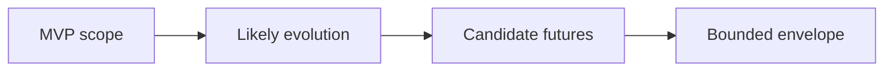
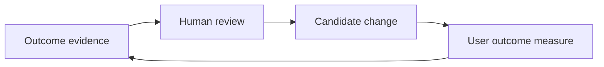

# Maximal Scenario Envelope for the North Star

## 1. Document Status, Purpose and Authority

| Field | Value |
|---|---|
| Status | Candidate vision input |
| Version | 0.1 |
| Authority | Non-normative; human review required |
| Traceability | [GitHub issue #8](https://github.com/frwkHoangQuy/Mnemograph_workbench/issues/8) |
| Primary input | [User Value System and Controlled Flywheel](user-value-system-and-flywheel-v0.1.md) |
| Relationship to authority | This document does not supersede, amend, or reinterpret the Project Charter, System Design, or accepted ADRs. |
| Delivery boundary | This document does not revise Delivery D1 or authorize Delivery D1.2. |

This candidate document defines a bounded mature-state scenario envelope that a future North Star architecture may evaluate. It catalogues user-value pressures and control questions implied by the primary input without converting future possibilities into current scope.

It is a scenario and pressure catalogue. It is not a product promise, forecast, backlog, architecture specification, capacity plan, or implementation authorization. It does not select components, databases, providers, protocols, deployment topologies, frameworks, or operational targets.

## 2. Relationship to the User Value System Document

The [User Value System and Controlled Flywheel](user-value-system-and-flywheel-v0.1.md) describes the user value to protect: reviewable learning, evidence-aware decisions, bounded experiments, reusable capability, privacy, provenance, and human authority. This envelope examines the pressures that could challenge those values if users later progress from one private room toward linked or organizational work.

The relationship is directional and non-normative:

| Primary input element | Envelope use | What this document does not change |
|---|---|---|
| User archetypes and progressive value ladder | Identifies how a person or organization may encounter more complex situations | User-facing commitments or current scope |
| Product spaces and linked rooms | Identifies candidate room-topology pressures | Any room federation implementation or authorization |
| Flywheels and outcome measures | Identifies controls against false confidence, metric theater, and harmful optimization | Evaluation, telemetry, or improvement implementation |
| Data ownership and memory scopes | Identifies consent, revocation, freshness, and isolation pressures | Retention, deletion, access, or consent policy decisions |

The envelope does not repeat the complete primary input. It uses that document as a candidate source of user-value and control questions, not as an architecture specification.

## 3. Definition of the Bounded Maximal Scenario Envelope

A bounded maximal scenario envelope is the set of plausible pressures that a future architecture should evaluate because they are directly implied by the primary user-value vision. It is intentionally narrower than unrestricted speculation and intentionally broader than the first MVP.

The envelope asks whether later choices preserve optionality for valuable, plausible situations. It does not state that those situations will occur, should be delivered, or are authorized now. A future possibility can be useful as an evaluation pressure even when it remains deliberately deferred.

The arrows represent increasing scenario breadth for analysis, not a delivery sequence, forecast, or product roadmap.

## 4. Classification Vocabulary

| Classification | Meaning in this document | What it does not mean |
|---|---|---|
| **MVP-observed capability** | A value, boundary, or situation exercised by the first MVP as described by the accepted baselines and primary input | A new MVP requirement or implementation detail |
| **Likely evolutionary capability** | A plausible next-stage pressure that follows directly from user progression | A committed delivery, timeline, or forecast |
| **Candidate future capability** | A meaningful but uncertain possibility that later evaluation may examine | A product promise, backlog item, or approved requirement |
| **Preserve-option / must-not-unnecessarily-preclude** | A future architecture question about avoiding needless foreclosure of a valuable option | A synonym for "must be implemented" or an authorization to build it now |
| **Out-of-envelope speculation** | A possibility not directly implied by the primary input or current authority | A design pressure for the current workbench |

"Must not be precluded" is not a synonym for "must be implemented." It means later human review may ask whether a choice needlessly prevents a valuable, plausible option. It does not create a commitment, select an implementation, or override the first MVP containment.

## 5. User and Organization Progression Envelope

One person may move through multiple archetypes, return to an earlier one, or stop without progressing. The envelope preserves the standalone user as a valid long-term situation while considering additional pressures that may emerge later.

| Situation | Candidate value at stake | Classification | Later evaluation question |
|---|---|---|---|
| Learner in a private room | Safe, reviewable learning without accidental sharing | Likely evolutionary capability | Can a future learning-specific room preserve privacy and provenance while reusing the standalone-room boundary? |
| Researcher or creator developing an insight | Evidence, objections, and limitations remain connected to the insight | MVP-observed capability | Can an insight remain distinguishable from a claim, recommendation, or accepted knowledge? |
| Builder or founder testing a commercial hypothesis | Real customer and outcome evidence can challenge enthusiasm | Likely evolutionary capability | Can commercial learning remain separate from scientific support and web attention? |
| Organization operator coordinating work | Shared decisions retain ownership, scope, and rationale | Candidate future capability | Can coordination preserve local accountability and avoid treating every room as organization-wide? |
| Multi-team or multi-organization work | Cross-boundary learning occurs with consent and revocation | Preserve-option / must-not-unnecessarily-preclude | Can later collaboration preserve distinct principals, scopes, and authority boundaries? |

## 6. Room Topology Envelope

Rooms are candidate user-facing containers for purpose, context, participants, and reviewable artifacts. This envelope does not prescribe room implementation, topology, or federation behavior.

| Topology situation | Value being protected | Classification | Candidate later evaluation question |
|---|---|---|---|
| One standalone private room | Simple, low-overhead learning and user control | MVP-observed capability | Can the standalone-room use case remain first-class as other situations are considered? |
| Linked research, venture, and engineering rooms | Purpose-specific work without forcing all context into one place | Likely evolutionary capability | Can links carry only explicitly selected, reviewable artifacts rather than unrestricted context? |
| Federated room graph | Coordinated work across multiple teams or organizations | Candidate future capability | Can a future graph preserve room isolation, provenance, and selective sharing? |
| Asynchronous handoff between rooms | Progress without requiring simultaneous participation | Candidate future capability | Can a handoff preserve decision version, uncertainty, and the limits of the receiving room's authority? |
| Conflicting room conclusions | Visible disagreement rather than false consensus | Preserve-option / must-not-unnecessarily-preclude | Can incompatible recommendations remain attributable, comparable, and unresolved when appropriate? |

## 7. Dynamic Role and Authority Envelope

An employee or department metaphor may be useful to a user, but role-agents remain configurable software principals. They are not employees, legal agents, corporate officers, contracting parties, or autonomous authorities.

| Principal or role situation | Candidate value at stake | Classification | Candidate later evaluation question |
|---|---|---|---|
| Human principals | Authority stays with named people or authorized groups | MVP-observed capability | Can human approval remain visible for scope, acceptance, sharing, and external action? |
| AI role-agents | Specialized drafting, challenge, classification, and recommendation | MVP-observed capability | Can a role-agent remain constrained by its current authority without acquiring legal, financial, publishing, production, or contractual power by implication? |
| Deterministic services | Reproducible calculations or transformations | Likely evolutionary capability | Can deterministic output remain distinguishable from evidence, inference, and human approval? |
| Moderators, reviewers, and auditors | Reviewable process and disagreement | Likely evolutionary capability | Can review roles expose concerns without silently resolving them or exercising decision authority? |
| Department or coordination roles | Coordinated organizational work | Candidate future capability | Can a coordination role preserve the authority and ownership of participating humans and rooms? |
| Temporary specialist role not previously known | Context-specific expertise | Preserve-option / must-not-unnecessarily-preclude | Can a future specialist be proposed and bounded without granting it unreviewed access or authority? |

## 8. Knowledge, Evidence and Source Envelope

The envelope includes user documents, scientific literature, current web sources, organizational knowledge, customer and market evidence, and deterministic tool output. It treats source status as part of the user value rather than as background metadata.

| Source pressure | Candidate value at stake | Candidate later evaluation question |
|---|---|---|
| A user-provided document has licensing, confidentiality, privacy, or retention constraints | Respect for user and third-party rights | Can the document's permitted use and limitations remain visible when it informs later artifacts? |
| A scientific source is corrected, retracted, or unavailable | Grounded claims can be revisited | Can claims retain their source basis, revision status, and uncertainty when a source changes? |
| A web source changes after informing a decision | Time-sensitive signals remain contextualized | Can a decision show what was observed, when, and what later changed without treating the web source as permanent truth? |
| Organizational knowledge is stale or contradictory | Reuse does not amplify obsolete guidance | Can competing versions remain visible rather than being collapsed into one unqualified memory? |
| Customer and market evidence conflicts with a scientific opportunity | Commercial validation remains empirical | Can evidence of customer need and real outcomes remain distinct from scientific support, trend signals, and internal enthusiasm? |

Private model chain-of-thought is neither required nor exposed. The reviewable record is the visible claim, objection, evidence basis, uncertainty, and human decision rationale.

## 9. Memory and Context Envelope

This envelope distinguishes transient working context from persistent memory. Per-turn context is a bounded selection of material for one interaction. System memory is persistent material intended for later retrieval or reuse and requires scope, provenance, owner, and approval status. A memory candidate is not accepted knowledge and is not system memory until explicitly approved.

| Memory or context situation | Candidate pressure | Classification | Candidate later evaluation question |
|---|---|---|---|
| Working context exceeds every current model window | Completeness conflicts with bounded context | Preserve-option / must-not-unnecessarily-preclude | Can later evaluation preserve source and decision continuity without assuming unlimited context? |
| Immutable history and episodic memory | Prior turns may matter without dominating current work | Likely evolutionary capability | Can historical material remain attributable, scoped, and selectively relevant? |
| Accepted knowledge and decision memory | Approved statements and reasons may need later reuse | Candidate future capability | Can accepted knowledge remain distinguishable from memory candidates, assumptions, and unverified model prior knowledge? |
| Procedural and evaluation memory | Reusable practice may improve work | Candidate future capability | Can reuse preserve the difference between an observed pattern and an approved procedure? |
| Selective retention, forgetting, revocation, and deletion | User control may conflict with reuse | Preserve-option / must-not-unnecessarily-preclude | Can later policy and architecture evaluate revocation and deletion without assuming permanent organizational memory? |

No session may become organizational memory, system-learnable material, training data, or a public case study without the separate explicit approval appropriate to that target scope.

## 10. Model and Tool Envelope

This envelope considers multiple API providers, local or open-weight models, free or quota-limited models, per-role or per-task configuration, fallback, provider outage, model migration, cost-quality trade-offs, and tool permissions. It does not select any model, provider, tool, or dependency.

| Situation | Candidate value at stake | Candidate later evaluation question |
|---|---|---|
| Provider availability or behavior changes | Continuity and comparable quality | Can a later design evaluate provider change without binding claims, decisions, or authority to one provider's behavior? |
| Lower-cost local or free model has lower quality | Cost is managed without silently degrading outcomes | Can cost-quality routing remain reviewable against user outcomes, provenance, and safety rather than price alone? |
| Different roles need different model or tool profiles | Role isolation and fit-for-purpose behavior | Can per-role configuration preserve authority boundaries and visible provenance without assuming a single model choice? |
| Tool access could trigger external effects | Human control over consequential action | Can tool permissions remain bounded to the role, room, user approval, and current task? |

## 11. Commercial and Market-Feedback Envelope

Commercial value is a candidate to investigate, not an automatic result of scientific merit, model output, or web attention. A commercial hypothesis may require a defined customer or user, a measurable outcome, and a disconfirming condition.

| Commercial situation | Candidate value at stake | Candidate later evaluation question |
|---|---|---|
| A concept attracts current web attention | Timely signals can inform questions | Can trend evidence remain distinct from customer need, willingness, adoption, and outcome evidence? |
| A scientific opportunity appears promising | Research can inform a hypothesis | Can the work retain an explicit boundary between scientific support and commercial viability? |
| An experiment produces a negative or stop outcome | Waste is avoided and learning is retained | Can a justified stop decision become reusable learning without being rewritten as a success claim? |
| Multiple rooms create commercial momentum | Enthusiasm is balanced by evidence | Can commercial advocacy remain challengeable by source quality, objections, and real outcomes? |

## 12. Learning and Personal-Development Envelope

Learning value includes better questions, clarified uncertainty, demonstrated understanding, and a justified decision to stop. It does not require perpetual engagement or a claim of expertise.

| Learning situation | Candidate value at stake | Candidate later evaluation question |
|---|---|---|
| A person returns to a prior learning room | Reuse without false certainty | Can prior artifacts remain reviewable for freshness, source status, and changed assumptions? |
| A learner becomes a researcher or creator | Progress across archetypes | Can the system preserve the distinction between personal understanding, evidence-backed claims, and new proposals? |
| A user rejects an earlier conclusion | Reversibility and honest learning | Can revision preserve the earlier rationale and show why it changed? |
| A negative outcome becomes a teaching artifact | Learning from disconfirmation | Can the artifact retain its context and limits without becoming a universal rule? |

## 13. Product and Engineering Execution Envelope

The primary input permits a user to move from insight to a bounded experiment and potentially a product or organizational capability. This envelope treats product and engineering execution as a user-value pressure, not as authorization to create code, run production systems, or choose implementation approaches.

| Execution situation | Candidate value at stake | Candidate later evaluation question |
|---|---|---|
| Research insight informs a product hypothesis | Traceability from evidence to action | Can an experiment preserve what was supported, assumed, and chosen by humans? |
| Engineering work needs a decision rationale | Reversible and accountable execution | Can the rationale remain visible without treating a role-agent recommendation as an approved decision? |
| Multiple rooms hand off an artifact | Context-specific work and review | Can a handoff remain bounded to explicitly selected artifacts, constraints, and authority? |
| A product path should be stopped | Avoiding sunk-cost escalation | Can a stop decision remain a valid reviewable artifact and source of later learning? |

## 14. External Integration and Action Envelope

Candidate future situations may involve source repositories, issue trackers, analytics, CRM, financial tools, communication systems, or other external systems. Mentioning them does not authorize integration, access, automation, or action.

| External situation | Candidate value at stake | Candidate later evaluation question |
|---|---|---|
| External record informs a room | Relevant context with provenance | Can external material retain source, permission, freshness, and scope information? |
| A room proposes an update to an external system | Human control over consequential action | Can the proposal remain reviewable and require explicit human approval before any external effect? |
| Financial, legal, customer, or personal information is present | Privacy and authority | Can later evaluation preserve least necessary sharing and avoid treating a role-agent as a legal or financial authority? |
| A communication system carries a recommendation | Accountability and consent | Can recipients see the source, uncertainty, and human approval status without exposing private reasoning? |

## 15. Governance, Privacy, Security and Compliance Envelope

Privacy is private by default. Governance concerns include source rights, consent, access scope, revocation, deletion, provenance, auditability, confidentiality, and the ability to challenge a decision. The envelope does not select a compliance regime, identity model, authentication approach, or security implementation.

| Pressure | Candidate value at stake | Candidate later evaluation question |
|---|---|---|
| Sensitive data crosses a room boundary | User trust and confidentiality | Can cross-room sharing be explicit, selective, reversible where policy permits, and attributable to an approving human? |
| Consent changes after sharing or memory promotion | Revocation and deletion rights | Can later evaluation distinguish revocation, deletion, retention obligations, and historical decision traceability? |
| Prompt injection or malicious content enters via documents or web material | Integrity of user intent and evidence review | Can untrusted content remain content to evaluate rather than authority that changes role behavior? |
| A role-agent attempts an unauthorized action | Human authority and accountability | Can the attempt remain visible, non-binding, and subject to a human decision? |

## 16. Reliability and Long-Running-Operation Envelope

Long-running work may involve pauses, asynchronous handoffs, changing sources, partial availability, budget boundaries, and a need to revisit why a decision was made. This is not a capacity plan and does not define availability targets or implementation mechanisms.

| Situation | Candidate value at stake | Candidate later evaluation question |
|---|---|---|
| A multi-room workflow pauses before a decision | Continuity and user control | Can work resume with its visible scope, evidence, objections, and authority boundaries intact? |
| A provider or source becomes unavailable | Honest uncertainty and recoverability | Can the record show what is unavailable and prevent unavailable material from being silently treated as current? |
| A decision is revisited after a long interval | Traceability and reversibility | Can the user inspect its version, rationale, sources, and changed assumptions? |
| Budget exhaustion interrupts a workflow | Bounded cost without false completion | Can interruption preserve a clear user choice to continue, narrow, defer, or stop rather than infer completion? |

## 17. Evaluation, FinOps and Controlled-Improvement Envelope

Cost, latency, and token use are operational factors. They are not sole measures of value. Candidate system improvement should be evaluated against user outcomes, provenance, trust, privacy, and negative consequences. No self-improvement runtime is authorized by this document or by the first MVP.

| Evaluation pressure | Candidate value at stake | Candidate later evaluation question |
|---|---|---|
| A proposed improvement reduces cost | Efficient operation without hidden harm | Can outcome quality, uncertainty, and user control be evaluated alongside cost reduction? |
| Activity increases while learning declines | Meaningful value over metric theater | Can evaluation privilege user outcomes and justified negative learning over volume, tokens, or apparent throughput? |
| Opted-in material informs system evaluation | Consent and limited reuse | Can the scope of opt-in remain explicit and revocable under later policy decisions? |
| A model or tool behavior changes | Comparable user outcomes | Can evaluation distinguish changed behavior from changed source conditions, user goals, or room context? |

## 18. Maximal Stress-Scenario Catalogue

Each row is a candidate stress scenario, not a backlog item. The candidate control is written as a later-evaluation question and does not prescribe an implementation. "MVP relevance" distinguishes current exercise from future analysis; it does not add scope.

| Scenario ID and name | User or organization situation | User value being protected | Pressure or failure introduced | Candidate control or invariant for later architectural evaluation | Lifecycle classification | MVP relevance | What is not authorized now |
|---|---|---|---|---|---|---|---|
| **MSE-01 - Private learning room** | One user works in one private learning room with permitted context. | Private, reviewable learning and human control. | Accidental sharing or treating model output as accepted knowledge. | Can private-by-default material remain scoped while claims, objections, evidence, and rationale stay reviewable? | Likely evolutionary capability | The single-user standalone-room boundary is MVP-observed; learning-specific behavior is deliberately deferred. | No Learning Studio, tutoring, assessment, privacy, retention, or memory implementation. |
| **MSE-02 - Linked research, venture, and engineering rooms** | One user operates linked research, venture, and engineering rooms. | Purpose-specific work and selective reuse. | Context leakage or false transfer of authority between rooms. | Can links carry only explicitly selected artifacts with source, uncertainty, and scope? | Likely evolutionary capability | Represented only as a future architectural question; no linked rooms in the MVP. | No room federation, linked-room implementation, or cross-room automation. |
| **MSE-03 - Multi-team dynamic roles** | A multi-team organization changes role assignments over time. | Accountability and understandable authority. | Stale access or authority being inferred from a role label. | Can role changes remain attributable to human principals and preserve prior decision ownership? | Candidate future capability | Deliberately deferred. | No organization topology, authorization model, or role-management implementation. |
| **MSE-04 - Incompatible room recommendations** | Two rooms produce incompatible recommendations. | Visible disagreement and reversible decisions. | False consensus or one room silently overriding another. | Can incompatible recommendations remain attributable, comparable, and unresolved until a human decides? | Preserve-option / must-not-unnecessarily-preclude | Visible disagreement is exercised in one room; cross-room conflict is a future question. | No cross-room conflict resolution or room federation. |
| **MSE-05 - Context exceeds current model windows** | Long-running work has more relevant context than any current model window. | Continuity, provenance, and bounded reasoning. | Lost assumptions, missing evidence, or false completeness. | Can later evaluation preserve relevant source and decision continuity without assuming unlimited context? | Preserve-option / must-not-unnecessarily-preclude | Represented only as a future architectural question. | No context-compilation, retrieval, or model-routing implementation. |
| **MSE-06 - Stale or contradictory organizational memory** | Organizational memory contains stale or conflicting knowledge. | Honest reuse and visible uncertainty. | Obsolete guidance is repeated as current truth. | Can competing memory candidates and accepted knowledge retain version, status, owner, and contradiction information? | Candidate future capability | Deliberately deferred; the MVP has no organizational-memory promotion automation. | No organizational memory system, policy, or conflict-resolution mechanism. |
| **MSE-07 - Revoked memory or sharing consent** | A user revokes prior consent for memory or sharing. | Consent, revocation, and trust. | Reuse continues after consent changes. | Can later evaluation distinguish revocation, deletion, permitted retention, and historical decision traceability? | Preserve-option / must-not-unnecessarily-preclude | Represented as a policy and architecture question. | No consent, deletion, or retention implementation or policy decision. |
| **MSE-08 - Corrected, retracted, or unavailable scientific source** | A scientific source changes, is retracted, or can no longer be accessed. | Evidence integrity and revisability. | Claims outlive their valid source basis. | Can claims show their source status, locator, limitations, and need for review when a source changes? | Likely evolutionary capability | Represented as a future evidence-evaluation question. | No source-ingestion, monitoring, or citation-validation implementation. |
| **MSE-09 - Changed web source after decision** | A web source changes after informing a decision. | Time-bounded provenance and honest rationale. | Later readers mistake a changed page for the original evidence. | Can a decision show what was observed, when, and what later changed without treating a web signal as permanent truth? | Likely evolutionary capability | Represented as a future source-freshness question. | No web capture, monitoring, or integration implementation. |
| **MSE-10 - Provider outage or material behavior change** | A model provider becomes unavailable or behaves materially differently. | Continuity and comparable review. | Output changes are mistaken for a user, evidence, or decision change. | Can later evaluation distinguish provider behavior change from changes in source, room, or human direction? | Preserve-option / must-not-unnecessarily-preclude | Represented only as a future architectural question. | No provider selection, fallback, migration, or dependency authorization. |
| **MSE-11 - Lower-quality cheaper free or local model** | A free or local model costs less but produces lower-quality output. | User outcomes over cost alone. | Cost optimization silently damages grounding, learning, or decision quality. | Can quality, provenance, uncertainty, and user outcomes be evaluated alongside cost before a trade-off is accepted? | Candidate future capability | Deliberately deferred. | No model selection, local-model adoption, or cost-routing implementation. |
| **MSE-12 - Budget exhaustion in multi-room workflow** | A multi-room workflow reaches a budget boundary before completion. | Bounded cost and user termination authority. | Work is treated as complete or continues without a human choice. | Can interruption retain current evidence, objections, uncertainty, and a clear human choice to continue, narrow, defer, or stop? | Candidate future capability | The first MVP has bounded deliberation; multi-room budget behavior is deferred. | No budget-management, billing, or multi-room workflow implementation. |
| **MSE-13 - Prompt injection or malicious content** | A document or web source contains content intended to redirect a role-agent. | Integrity of user intent and evidence review. | Untrusted content is treated as authority or instruction. | Can untrusted material remain content to evaluate rather than authority that changes role behavior or access? | Likely evolutionary capability | Relevant to permitted context, but no new control implementation is authorized. | No security-control, parser, tool, or content-processing implementation. |
| **MSE-14 - Sensitive data crosses room boundaries** | Financial, legal, health, personal, or confidential data could cross rooms. | Privacy by default and selective sharing. | Scope loss or disclosure beyond the intended audience. | Can later evaluation make every cross-room disclosure explicit, attributable, minimal, and reversible where policy permits? | Preserve-option / must-not-unnecessarily-preclude | Represented only as a future architectural question; no room federation in the MVP. | No cross-room data sharing, privacy policy, or access-control implementation. |
| **MSE-15 - Role-agent attempts unauthorized action** | A role-agent proposes or attempts a financial, legal, publishing, production, or contractual action. | Human authority and accountability. | A recommendation is mistaken for authority to act. | Can any consequential action remain non-binding until an authorized human reviews and approves it? | MVP-observed capability | Exercised as a first-MVP authority boundary. | No autonomous action, external execution, or delegated legal authority. |
| **MSE-16 - Provider or storage migration** | An organization migrates model providers or storage infrastructure. | Continuity, provenance, and reversibility. | Versioned decisions or memory lose meaning across a change. | Can later evaluation preserve provenance, scope, decision version, and human authority across a migration without selecting a technology? | Preserve-option / must-not-unnecessarily-preclude | Represented only as a future architectural question. | No migration design, storage decision, provider choice, or infrastructure work. |
| **MSE-17 - Temporary unknown specialist role** | A room needs a temporary specialist role not previously known. | Fit-for-purpose assistance without authority creep. | A new role receives broad context or authority by default. | Can a proposed specialist remain explicitly scoped by purpose, context, permissions, and human oversight? | Candidate future capability | Deliberately deferred. | No dynamic-role implementation, agent creation, or tool-permission change. |
| **MSE-18 - Improvement reduces cost but harms outcomes** | An improvement agent proposes a lower-cost change that damages outcome quality. | Controlled improvement and user value. | Cost metrics replace learning, trust, or decision quality. | Can a candidate change be evaluated against user outcomes, provenance, uncertainty, and harm rather than cost alone? | Candidate future capability | Deliberately deferred; no self-improvement runtime in the MVP. | No autonomous optimization, runtime improvement, or evaluation pipeline implementation. |
| **MSE-19 - Commercial enthusiasm amplifies unsupported claim** | Commercial momentum repeats a claim that lacks adequate scientific support. | Separation of evidence, inference, and commercial advocacy. | Repetition turns an unsupported claim into apparent fact. | Can visible objections, source status, and real customer outcomes challenge a commercially attractive but unsupported claim? | Likely evolutionary capability | Evidence and objection visibility are exercised in one room; commercial orchestration is deferred. | No commercial automation, claim-promotion workflow, or market integration. |
| **MSE-20 - Negative or stop outcome becomes reusable learning** | A justified negative outcome or stop decision should inform later work. | Honest learning and avoidance of repeated waste. | Negative results are hidden, treated as failure, or generalized beyond their context. | Can reusable learning preserve the stopping rationale, context, evidence, limits, ownership, and approval scope? | Candidate future capability | A stop decision is within first-MVP authority; reusable organizational learning is deferred. | No organizational-memory promotion, learning automation, or retention policy. |

## 19. Candidate Cross-Cutting Invariants for Later Evaluation

These are candidate questions and properties for later human and architectural evaluation. They do not select an implementation or become accepted requirements through inclusion here.

| Invariant theme | Candidate evaluation question or property |
|---|---|
| Human authority | Can every acceptance, sharing, memory promotion, external action, and consequential decision remain attributable to an authorized human? |
| Provenance | Can a reviewable artifact show the relevant source, evidence, objection, version, uncertainty, and decision rationale? |
| Privacy by default | Can private material remain private unless a person explicitly approves a stated wider scope? |
| Room isolation | Can each room retain its own purpose, context, participants, and authority boundaries? |
| Selective cross-room sharing | Can shared material be explicitly selected, scoped, and attributable rather than copied by default? |
| Role and authority separation | Can a role-agent's configured task remain distinct from financial, legal, publishing, production, or contractual authority? |
| Model and provider replaceability | Can later evaluation assess behavior change and portability without binding user artifacts or decisions to one provider? |
| Bounded cost and execution | Can resource limits produce a reviewable human choice rather than a false completion or unbounded run? |
| Versioned decisions and memory | Can accepted knowledge, memory candidates, source changes, and decision revisions remain distinguishable over time? |
| Reversibility and revocation | Can later policy evaluate correction, reopening, consent withdrawal, deletion, and retention obligations without assuming irreversibility? |
| Visible uncertainty and disagreement | Can uncertainty, counter-evidence, incompatible recommendations, and unresolved questions remain visible? |
| Negative outcomes as learning | Can a justified negative result or stop decision remain a valid artifact without being misrepresented as success or discarded? |
| Context boundedness | Can relevant continuity be evaluated without assuming unrestricted context size or unrestricted sharing? |
| Source freshness and retraction | Can changed, retracted, corrected, unavailable, or stale sources trigger appropriate review rather than silent reuse? |
| Evaluation based on user outcomes | Can learning, decision quality, evidence quality, and real outcomes remain more important than tokens, cost, latency, or activity alone? |

## 20. MVP Containment and Non-Expansion Guardrails

The first MVP remains limited to:

- one user;
- one standalone room;
- Scientist, SA, and Moderator roles;
- user-provided permitted context;
- visible claims, objections, evidence, and rationale;
- user intervention and termination authority;
- bounded deliberation;
- two final documents;
- no room federation;
- no organizational-memory promotion automation;
- no self-improvement runtime; and
- no autonomous commercial, legal, financial, or production action.

| Capability status | Meaning | Examples in this envelope |
|---|---|---|
| **Exercised by the MVP** | Existing MVP scope as stated above; this document adds nothing to it | One private room, visible evidence and objections, human intervention, bounded deliberation, role-agent authority limits, two final documents |
| **Represented only as a future architectural question** | A pressure that later evaluation may examine | Linked rooms, context boundedness, provider change, migration, selective sharing, source freshness |
| **Deliberately deferred** | A meaningful possibility not included in current MVP scope | Organization-wide roles, organizational memory promotion, dynamic specialists, multi-room budget behavior, controlled improvement |
| **Outside the current envelope** | Speculation not directly implied by the primary input and therefore not a current pressure | Unlimited autonomous organizations, guaranteed market success, unrestricted data sharing, autonomous legal or corporate authority |

Maximal capability is not MVP scope. No catalogue row authorizes a Delivery D# change, and no preservation-of-option statement authorizes construction now.

## 21. Failure Modes and Anti-Goals

- Treating scenario breadth as a delivery roadmap, backlog, or promise.
- Converting "preserve-option" language into a requirement to implement every future possibility.
- Allowing room federation to imply unrestricted context, data, or authority sharing.
- Allowing organizational memory to imply permanent retention, automatic promotion, or use beyond explicit consent.
- Treating a role-agent as an employee, legal agent, autonomous corporate authority, or accountable owner.
- Treating scientific opportunity, model confidence, web attention, or internal enthusiasm as commercial validation.
- Treating a lower-cost output as better when it degrades grounding, user learning, decision quality, or trust.
- Hiding contradictory evidence, incompatible recommendations, retractions, or a justified decision to stop.
- Exposing or requiring private model chain-of-thought instead of recording reviewable rationale and uncertainty.
- Choosing a provider, model, database, queue, vector store, framework, cloud, deployment, or implementation from this scenario catalogue.

## 22. Traceability to User Journeys, Product Spaces and Flywheels

The matrix links this envelope back to the primary input without restating that document in full.

| Primary input element | Value or control stressed by this envelope | Representative scenarios |
|---|---|---|
| **Learner** | Private learning, bounded context, revision, and negative learning | MSE-01, MSE-05, MSE-07, MSE-20 |
| **Researcher or creator** | Source freshness, evidence quality, objection visibility, and retraction | MSE-04, MSE-08, MSE-09, MSE-13, MSE-19 |
| **Builder or founder** | Customer and outcome evidence, budget awareness, and justified stopping | MSE-02, MSE-11, MSE-12, MSE-19, MSE-20 |
| **Organization operator** | Dynamic authority, selective sharing, migration, and reusable learning | MSE-03, MSE-06, MSE-14, MSE-16, MSE-17 |
| **Research Studio** | Claims, sources, counter-evidence, and provenance | MSE-04, MSE-08, MSE-09, MSE-19 |
| **Learning Studio** | Private learning, context limits, and reflective revision | MSE-01, MSE-05, MSE-07, MSE-20 |
| **Venture Studio** | Commercial hypothesis testing and real outcomes | MSE-02, MSE-11, MSE-12, MSE-19, MSE-20 |
| **Organization Studio** | Linked work, memory scope, roles, and governance | MSE-03, MSE-06, MSE-14, MSE-16, MSE-17 |
| **Knowledge and learning flywheel** | Evidence quality, uncertainty, retraction, and reusable negative learning | MSE-05, MSE-06, MSE-08, MSE-09, MSE-20 |
| **Commercialization and market-feedback flywheel** | Customer evidence, disconfirmation, and resistance to hype | MSE-02, MSE-11, MSE-12, MSE-19, MSE-20 |
| **System-evaluation and improvement flywheel** | Opt-in, outcome quality, cost trade-offs, and controlled change | MSE-07, MSE-10, MSE-11, MSE-16, MSE-18 |

## 23. Assumptions

- The primary input remains a candidate vision document subject to human review and does not establish product requirements by itself.
- Users and organizations may have materially different consent, ownership, confidentiality, retention, and deletion obligations.
- The first MVP can remain valuable even if no linked rooms, organizational memory, external integrations, or self-improvement capabilities are ever pursued.
- Scientific sources, web sources, customer evidence, organizational knowledge, and user-provided material can change in quality, availability, rights, and relevance over time.
- More model capability, lower cost, more activity, or more connected rooms do not automatically create more user value.
- Human review can remain meaningful only when claims, evidence, objections, uncertainty, scope, and authority are visible enough to assess.

## 24. Open Questions Requiring Later Human Decisions

1. Which candidate scenarios are sufficiently likely and valuable to become inputs to a future North Star architecture review?
2. What evidence, review, and approval threshold should apply before material becomes accepted knowledge, reusable organizational memory, system-learnable material, or a public case study?
3. How should consent withdrawal, deletion, retention obligations, auditability, and historical decision traceability be reconciled in future policy?
4. What constitutes sufficient customer and real outcome evidence for different commercial experiments and risk levels?
5. Which forms of cross-room sharing are valuable enough to justify later evaluation, and which should remain prohibited regardless of convenience?
6. How should a future architecture evaluate source retraction, source freshness, and contradiction without overstating current evidence?
7. Which user outcome measures can guide cost and quality trade-offs without creating surveillance, metric gaming, or retention pressure?
8. Which temporary specialist, reviewer, coordinator, or auditor roles are useful without obscuring human accountability or granting implied authority?
9. What human approval is required before a role-agent may draft, propose, communicate, or request an external action in each context?
10. Which future possibilities belong outside this envelope because they are not directly implied by the user-value vision?

## 25. Explicit Non-Goals

- This document does not amend, reinterpret, replace, or supersede the Project Charter, System Design, or accepted ADRs.
- It does not revise Delivery D1, authorize Delivery D1.2, or authorize any other Delivery D# work.
- It does not create source code, architecture decisions, dependency changes, model or provider selections, framework choices, storage choices, workflow changes, or implementation plans.
- It does not set numerical scale targets, capacity plans, cost targets, availability commitments, or SLA promises.
- It does not implement room federation, organizational memory, consent handling, deletion, authentication, external integration, migration, self-improvement, evaluation, or commercial automation.
- It does not authorize autonomous commercial, legal, financial, publishing, production, contractual, or other consequential action.
- It does not require or expose private model chain-of-thought.
