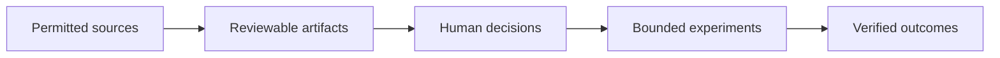

# North Star System Vision — Version 1.0

## Document Status and Authority

| Field | Value |
|---|---|
| Status | Candidate |
| Version | 1.0 |
| Authority | Non-normative; human review required |
| Traceability | [GitHub Issue #10](https://github.com/frwkHoangQuy/Mnemograph_workbench/issues/10) |
| Primary input 1 | [User Value System and Controlled Flywheel](user-value-system-and-flywheel-v0.1.md) |
| Primary input 2 | [Maximal Scenario Envelope for the North Star](maximal-scenario-envelope-v0.1.md) |
| Decision boundary | This document does not authorize architecture or implementation changes. |
| Delivery boundary | This document does not revise Delivery D1 or authorize Delivery D1.2. |
| Relationship to authority | This document does not supersede, amend, reinterpret, or replace the Project Charter, System Design, or accepted ADRs. |

This is a candidate synthesis for human review. It combines the user-value vision with the bounded mature-state scenario envelope into one coherent direction for later North Star evaluation. It is not a forecast, product promise, backlog, implementation plan, or architecture specification.

Its candidate identity can be stated as a human-governed, evidence-aware, AI-assisted collaboration workbench with composable rooms and role-agents, reviewable artifacts, bounded commercial experimentation, progressive individual and organizational value, and no guarantee of success.

## 1. Executive North Star Statement

The candidate North Star is a user-controlled system for turning permitted sources, current signals, personal observations, and verified experience into reviewable learning, deliberate decisions, bounded experiments, and reusable capability. It protects provenance, privacy, uncertainty, reversibility, and human authority as value expands from one person in one room toward possible future collaboration.

The system is deliberately a controlled self-reinforcing system, not a claim of guaranteed or infinite value. A better question, a rejected hypothesis, a justified stop decision, or a documented limitation may be valuable outcomes. Scientific opportunity, market attention, and model fluency are inputs to examine, not proof of commercial value or accepted knowledge.

## 2. System Identity and Product Category

The candidate product category is a **governed evidence-to-action workbench**. It brings together research, learning, commercial experimentation, and organizational coordination around reviewable artifacts rather than treating conversation as the final product.

The workbench is not merely a chat application, a source repository, a project-management system, a corporate authority, or an autonomous business operator. A room is not merely a chat thread: it is a candidate user-facing boundary for purpose, permitted context, participants, reviewable artifacts, authority limits, and explicit sharing choices.

## 3. User Problems, Promise, and Value Proposition

People often move among disconnected research, note-taking, market-reading, decision, experimentation, and coordination tools. In that movement, evidence loses its link to claims, assumptions become remembered as facts, web attention is confused with customer demand, and a transcript substitutes for a decision record.

The candidate promise is not an answer machine. It is a way to make the path from source to claim, objection, uncertainty, rationale, decision, experiment, and outcome inspectable. The intended value is helping a person decide what to learn next, what to validate, what to share, what to defer, and when to stop.

## 4. User Archetypes and Progressive User-Value Journey

One person may progress through several archetypes, move backward, or stay in one. These are user situations, not access roles or authority grants.

| Archetype | Primary need | Candidate value progression | Guardrail |
|---|---|---|---|
| **Learner** | Understand material and identify uncertainty | Question -> reviewable learning artifact -> revised understanding | Learning-specific behavior is not part of the first MVP. |
| **Researcher or creator** | Develop a claim, concept, or research direction | Evidence and objections -> bounded insight candidate -> human decision | Model output is not accepted knowledge merely because it is repeated. |
| **Builder or founder** | Test whether an insight matters to a customer or operation | Hypothesis -> bounded experiment -> customer and real outcome evidence | Scientific merit and web trends do not establish commercial viability. |
| **Organization operator** | Coordinate decisions and approved reusable knowledge | Scoped artifacts -> deliberate sharing -> accountable operating capability | Room linkage does not infer authority or unrestricted context sharing. |

The progressive journey is orient, learn, frame, test, observe, and selectively reuse. It is not a funnel or a maturity mandate. At any point, a user may pause, reopen, reject, or stop.

## 5. Four Composable Product Spaces

These are candidate user-facing product spaces, not prescribed modules, services, or delivery commitments.

| Product space | Candidate user purpose | Reviewable artifacts | Boundary |
|---|---|---|---|
| **Research Studio** | Investigate a question with source-aware claims and objections | Research questions, evidence links, claim maps, limitations | A model answer or source list is not accepted knowledge by itself. |
| **Learning Studio** | Build understanding from materials and practice | Learning plans, explanations, questions, reflections, evidence-backed notes | Candidate possibility; no Learning Studio behavior is included in the first MVP. |
| **Venture Studio** | Turn a bounded insight into a commercial hypothesis | Customer problem statements, experiment briefs, interview records, outcome evidence | Trend signals do not replace customer and real outcome evidence. |
| **Organization Studio** | Coordinate connected rooms, decisions, and approved organizational memory | Shared decision records, role proposals, approved operating artifacts | Private or room-only material does not become organization-wide by implication. |

## 6. Standalone-Room-First User Experience

The candidate experience begins with one user and one standalone room. The first path is compact: state one bounded goal, provide permitted sources or other permitted context, receive a proposed room and role configuration, approve or adjust the roles and permitted context, inspect claims, objections, evidence, uncertainty, and concise rationale, and then intervene, pause, stop, reopen, or approve. The result is a reviewable artifact and a decision record rather than an opaque transcript.

Later candidate possibilities only, and not part of the first MVP, may include configuring tool access, model policy, and budget, and linking selected rooms when that is useful. Those later steps remain optional and must not expand the exact first MVP.

The standalone room is not a reduced version of an organization. It is a first-class value boundary that should remain useful even if no linked rooms, organizational memory, external integrations, or controlled improvement capabilities are later pursued.

## 7. Room and Optional Room-Network Vision

A future room network is a candidate possibility, not a current commitment. Linked rooms could allow a person or organization to connect research, venture, engineering, learning, and operating work without collapsing them into one context.

The diagram describes a governance relationship, not implemented architecture. A future connection between rooms should be a preserve-option concern only: sharing may be selective, scoped, attributable, and private by default. A room network must not imply room federation, unrestricted context propagation, shared authority, or automatic organizational memory.

Linked-room conclusions may conflict. Conflicting conclusions remain visible, attributable, and unresolved unless an authorized human decides whether to accept, defer, reconcile, or retain the disagreement. No room silently overrides another, and no automatic consensus is inferred.

## 8. Dynamic Role-Agent Vision

The candidate mature state may include humans, AI role-agents, deterministic services, moderators, reviewers, auditors, coordination roles, and temporary specialist roles. Any such future capability is a candidate possibility or preserve-option concern, not a current role-management authorization.

A role-agent may be configured to draft, summarize, challenge, classify, retrieve permitted material, or recommend. It may not acquire financial, legal, publishing, production, contractual, or other consequential authority by implication. A temporary specialist role, if later considered, should remain explicitly bounded by purpose, context, permissions, human oversight, and a human decision.

## 9. Human, AI-Agent, Service, and System Participation

The candidate system distinguishes four kinds of participation:

| Participant | Candidate contribution | Authority boundary |
|---|---|---|
| **Human principal** | Sets goals, reviews scope, approves sharing, accepts or reopens conclusions, and authorizes consequential action | Retains responsibility and decision authority. |
| **AI role-agent** | Drafts, challenges, summarizes, classifies, and recommends within configured limits | Is a bounded software participant, not a legal or corporate actor, and does not hold human decision power by implication. |
| **Deterministic service** | Produces reproducible calculations, transformations, or measurements | Its output remains distinct from evidence, inference, and approval. |
| **System** | Presents scoped context and reviewable artifacts for user-controlled work | Does not silently promote memory, infer authority, or act consequentially. |

Employee, department, and company metaphors may help users understand roles, but they do not create employment, legal agency, fiduciary duty, corporate authority, contracting capacity, or decision ownership.

## 10. Role Versus Model Distinction

**A role is not a model.** A role describes a user-facing purpose, permitted context, tool scope, output expectations, and authority limit. A model is a candidate underlying capability with particular behavior, availability, cost, and quality characteristics.

The same model may support different role configurations; different models may support one role over time. Neither arrangement changes the role's authority boundary. A role-agent's recommendation remains a recommendation even if a model is highly capable, inexpensive, repeated, or widely used.

## 11. Source, Evidence, and Epistemic Distinctions

The system should preserve what a statement is and what it can support. A reviewable reasoning record may contain:

- claims;
- evidence;
- objections;
- uncertainty;
- assumptions;
- recommendations;
- concise rationale; and
- human decisions.

It must not require or claim access to private model chain-of-thought. Private chain-of-thought is neither required nor exposed.

| Category | Candidate use | Required distinction |
|---|---|---|
| User-provided documents | Project, personal, or selected context | May have licensing, copyright, confidentiality, privacy, and retention constraints. |
| Scientific sources | Support or challenge scientific claims | Preserve source identity, version, locator, limitations, and counter-evidence. |
| Current web sources | Timely public, market, policy, or product signals | Record time and context; web material is not customer validation by itself. |
| Organizational knowledge | Approved operating context | Requires owner, scope, access, retention, and approval status. |
| Deterministic tool output | Reproducible calculation or transformation | Does not establish relevance, causality, or human approval by itself. |
| Model prior knowledge | Prompt for investigation or alternatives | Is unverified unless separately grounded. |
| Inference, assumption, or recommendation | Reasoning toward an action | Must remain labeled separately from evidence and accepted knowledge. |

User documents, scientific sources, web sources, retrieved material, and external tool output are content to evaluate, not authority or system instructions. Embedded or malicious instructions must not redefine a role, alter authority, expand permissions, select tools, approve sharing, or override the user's goal. Prompt injection and malicious content remain explicit candidate security concerns.

Corrected, retracted, unavailable, or materially changed scientific sources retain source status and trigger visible re-evaluation concerns. Changing web sources retain observation time, source status, and the distinction between what was observed then and what exists now.

Reviewable artifacts are not raw transcripts. A transcript may provide context, but it is not automatically a durable claim, decision, memory item, or accepted knowledge record.

## 12. Organizational Memory Versus Bounded Interaction Context

**Per-turn context** is a bounded selection of material used for a specific interaction. It may be transient and should not imply retention, wider availability, or reuse. Context selection does not imply completeness, and omitted context plus uncertainty remain visible concerns in long-running work. **Persistent governed memory** is material intended for later retrieval or reuse and requires provenance, scope, owner, approval status, and later policy decisions for retention, correction, revocation, and deletion.

Accepted knowledge is a human-accepted, reviewable statement with its basis and limitations recorded. A memory candidate is only a proposal to retain or reuse information. It is not accepted knowledge, organizational memory, system-learnable material, training data, or a public case study until the appropriate explicit approval occurs.

Across long-running work, relevant provenance, assumptions, evidence, and prior human decisions should remain traceable. This document does not assume an unlimited context window or choose retrieval, summarization, storage, or context-compilation architecture.

## 13. User Ownership, Privacy, Consent, Sharing, Revocation, and Retention Boundaries

User material is private by default. Sharing is selective and scoped: it requires an explicit human choice about what may be shared, with whom, for which purpose, and under what retention or access limits. A room link does not grant access, transfer ownership, or delegate decision authority.

| Scope | Candidate meaning | Boundary |
|---|---|---|
| Private | Visible only to the user or explicitly authorized people | Default for user material and session content. |
| Room-only | Available to a named room and its permitted participants | Does not become workspace-wide or organizational memory automatically. |
| Workspace-shared | Available to a defined workspace audience | Requires explicit approval and stated access boundaries. |
| Approved organizational memory | Reusable organizational knowledge with owner and rationale | Requires separate explicit promotion, provenance, and later policy decisions. |
| System-learnable | Eligible for evaluation or improvement | Requires explicit opt-in; absence of opt-in means exclusion. |
| Public case study | Material allowed outside the organization | Requires a separate explicit opt-in. |

Revocation, deletion, retention obligations, auditability, and historical decision traceability are open human decisions. This document does not choose their policy or implementation.

## 14. Model/Tool Configuration and Cost-Quality Trade-Offs

A future system may evaluate multiple model or tool configurations, provider behavior changes, local or free alternatives, quota limits, task-specific configurations, and tool permissions. These are candidate possibilities; no provider, model, dependency, routing policy, or tool implementation is selected here.

The candidate decision rule is not "cheapest output wins." Cost, latency, token use, quality, grounding, provenance, uncertainty, safety, and user outcomes may all be relevant. A lower-cost output that damages evidence quality, learning, decision quality, or human control is not automatically a better outcome.

## 15. Learning, Research, Commercial, and Organizational Value Loops

The candidate system links four value loops without claiming that they all operate automatically or indefinitely.

- **Learning loop:** questions and sources produce reviewable learning; gaps and objections improve later questions.
- **Research loop:** claims are connected to evidence, counter-evidence, assumptions, limitations, and human decisions rather than repeated model language.
- **Commercial loop:** a bounded commercial hypothesis is tested with customer and real outcome evidence; negative or stop outcomes can be valid learning.
- **Organizational loop:** explicitly approved artifacts may become reusable capability, while private and room-only material remains protected by default.

## 16. Evaluation, Model FinOps, and Controlled Improvement

Evaluation asks whether the system helped users learn, decide, validate, coordinate, or avoid wasted effort while preserving evidence quality, privacy, provenance, and human control. It should not be reduced to activity volume, latency, tokens, or cost.

**Model FinOps** is the candidate discipline of observing and governing model-related resource use and cost-quality trade-offs. It may consider the cost, latency, token use, quality, grounding, and outcome effects of model or tool configurations. It is not a current optimization implementation and does not authorize a self-improvement runtime.

Any future controlled improvement is a candidate possibility. It should be subject to explicit opt-in, reviewable evidence, human oversight, outcome comparison, and the ability to reject or reverse a proposed change. The first MVP includes no self-improvement runtime.

## 17. Business Finance Versus Model FinOps

**Business Finance is not Model FinOps.** Business Finance concerns a human organization's financial planning, accounting, commitments, pricing, investment, revenue, and other financial decisions. Model FinOps concerns candidate observation and governance of model-related operational resource use and quality trade-offs.

Neither discipline grants a role-agent authority to spend funds, approve budgets, make investment decisions, enter contracts, alter financial records, or execute financial actions. Such matters remain consequential human decisions, even if a role-agent prepares a reviewable analysis.

## 18. Human Authority and Consequential-Action Boundaries

Human authority cannot be inferred from room linkage, role labels, repeated recommendations, or a user's passive presence. It must be explicit, attributable, and appropriate to the decision.

Role-agents may propose, draft, classify, and explain. They may not autonomously commit funds, sign or enter contracts, make legal representations, publish externally, initiate production activity, execute commercial actions, or make a binding decision for a person or organization. External actions remain reviewable proposals that require explicit human approval.

## 19. Mature-State Groupings for Later Evaluation

The mature state is a bounded envelope of candidate possibilities, not a commitment. It exists to preserve optionality for plausible user-value pressures while avoiding the claim that all such capabilities must be built.

| Grouping | Classification | Boundary |
|---|---|---|
| User and organizational scale | Candidate possibility | Larger scale does not imply guaranteed adoption, hierarchy, or a requirement to support every organizational size. |
| Room topology | Candidate possibility | Later room linking may be evaluated, but no room federation or unrestricted context propagation is included in the first MVP. |
| Role and authority diversity | Open human decision | More role types may be useful, but no role gains legal, corporate, financial, or decision power by label alone. |
| Evidence and source change | Candidate possibility | Source correction, retraction, unavailability, and time-bounded observation remain reviewable concerns, not a technology selection. |
| Memory and context longevity | Preserve-option concern | Preserve provenance, scope, version, and human decision history across future changes; no provider, storage, or context architecture is selected. |
| Provider, model, and tool diversity | Preserve-option concern | Continuity across provider, model, tool, or storage migration must remain reviewable without choosing a provider, model, tool, or storage technology here. |
| Market and commercial feedback | Candidate possibility | Commercial signals can inform bounded experiments, but they do not create guaranteed success or product-market fit. |
| External integration | Open human decision | External records and actions may later be reviewed, but no integration, automation, or external effect is authorized here. |
| Security and consent | Preserve-option concern | Untrusted content, prompt injection, consent, revocation, and selective sharing remain visible concerns without selecting a security product or policy engine. |
| Cost and reliability | Open human decision | Later evaluation may consider cost, latency, interruption, and recoverability, but no numerical SLA or operational target is set here. |
| Controlled system improvement | Candidate possibility | Any later improvement remains user-outcome driven and reviewable; no self-improvement runtime is included in the first MVP. |

Capabilities outside this bounded envelope include unrestricted context sharing, permanent memory by default, autonomous corporate authority, guaranteed commercial success, numerical scale promises, and any architecture or implementation commitment not separately approved.

## 20. Candidate System-Wide Principles

1. **Human control:** consequential acceptance, sharing, publication, and external action remain human decisions.
2. **Provenance:** sources, claims, objections, limitations, uncertainty, and rationale remain inspectable where feasible.
3. **Privacy by default:** broader sharing requires explicit scope and approval.
4. **Room isolation:** purpose and context stay bounded; links do not imply unrestricted access.
5. **Role and authority separation:** task capability does not create legal, financial, contractual, publishing, or production power.
6. **Epistemic clarity:** evidence, inference, model prior knowledge, recommendation, and accepted knowledge are distinguished.
7. **Reversibility:** revision, reopening, correction, revocation, and justified stopping remain visible concerns.
8. **Outcome orientation:** user learning, evidence quality, decision quality, and verified outcomes matter more than activity alone.
9. **Bounded execution:** cost and resource limits should produce a clear user choice, not false completion.
10. **Candidate humility:** mature-state possibilities remain candidate possibilities, preserve-option concerns, open human decisions, or explicitly out of scope.

## 21. Exact First MVP and Time-to-First-Value

The first MVP preserves exactly this boundary:

- one user;
- one standalone room;
- Scientist, SA, and Moderator roles;
- user-provided permitted context;
- bounded deliberation;
- visible claims, objections, evidence, and rationale;
- user intervention and termination authority;
- two final documents:
  - Scientific Rationale;
  - Architecture Advisory;
- no room federation;
- no Learning Studio behavior;
- no organizational-memory promotion automation;
- no self-improvement runtime; and
- no autonomous commercial, legal, financial, contractual, publishing, or production action.

Time-to-first-value means enabling that one user to turn a bounded question and permitted context into visible claims, objections, evidence, concise rationale, and a user-controlled next decision. It does not mean promising a particular time threshold, automated conclusion, Learning Studio behavior, external action, or completed commercial outcome.

## 22. Evolution Principles From MVP Toward the North Star

Evolution should be guided by demonstrated user value and human-approved decisions, not by a desire to fill the scenario envelope. Later evaluation may ask whether a proposed change preserves standalone-room value, improves traceability, respects consent, avoids authority creep, and can be reversed or declined.

The following are not a roadmap: candidate product spaces, optional room networks, governed memory, dynamic roles, provider flexibility, external integration, and controlled improvement. Each remains a candidate possibility, preserve-option concern, open human decision, or explicitly out of scope until separately reviewed and approved.

## 23. North Star Outcome Metrics

These are candidate outcome measures for later human review. They are not targets, telemetry commitments, or numerical service-level commitments.

| Candidate metric | Value indicated | Guardrail |
|---|---|---|
| Time to a reviewable artifact | A user reaches a source-aware learning, decision, or experiment artifact | Faster is not better if user control or provenance declines. |
| Traceability coverage | Accepted claims and decisions retain visible basis, objections, and rationale | Citations alone do not prove a claim is supported. |
| Learning progress | Change in demonstrated understanding or question quality | Confidence and exposure do not equal learning. |
| Decision quality and reversibility | Assumptions, alternatives, and reasons can be inspected and reopened | Fewer reversals are not automatically better. |
| Experiment evidence quality | Commercial tests include identified customers and real outcome evidence | Web trends and internal enthusiasm alone do not qualify. |
| Outcome realization | Work produces verified learning, customer value, operational improvement, or justified stopping | Negative outcomes count when they prevent waste. |
| Approved reuse quality | Reused knowledge retains correct scope and provenance | Unauthorized retention or sharing is not a success measure. |

## 24. Failure-Amplifying Loops and Anti-Goals

Failure amplification is a first-class concern:

- **Confidence loop:** unverified output enters unscoped memory, is repeated, and appears credible. Countermeasure concern: provenance, uncertainty, and explicit promotion gates.
- **Trend-chasing loop:** web attention becomes a false proxy for customer demand. Countermeasure concern: customer and real outcome evidence.
- **Memory-contamination loop:** private, room-only, stale, or low-quality material spreads into wider use. Countermeasure concern: scope, ownership, consent, freshness, and revocation.
- **Authority-creep loop:** helpful recommendations are mistaken for authority to act. Countermeasure concern: explicit human approval for consequential action.
- **Metric-theater loop:** tokens, cost, latency, or activity displace user outcomes and evidence quality. Countermeasure concern: outcome-oriented evaluation.
- **Optimization-harm loop:** a lower-cost change damages grounding, user learning, or decision quality. Countermeasure concern: compare trade-offs against user outcomes, not cost alone.

Anti-goals include treating mature-state possibilities as promises, treating a role-agent as an employee or legal actor, requiring or exposing private chain-of-thought, allowing room linkage to imply sharing or authority, and selecting an implementation architecture from this document.

## 25. Assumptions, Explicit Non-Goals, and Open Human Decisions

### Assumptions

- Users and organizations can identify who may provide, view, share, retain, approve, or revoke access to their material.
- Scientific, market, customer, organizational, and user-provided material will vary in quality, freshness, rights, and relevance.
- A reviewable artifact may be more valuable than a fast answer when a decision has material consequences.
- The first MVP can remain valuable even if later candidate possibilities are never pursued.

### Explicit Non-Goals

- No architecture, database, vector store, queue, framework, cloud, authentication provider, model provider, specific model, dependency, workflow, or implementation choice is made here.
- No numerical SLA, scale, capacity, cost, latency, or availability commitment is made here.
- No Delivery D1 revision, Delivery D1.2 authorization, source-code change, organizational-memory automation, room federation, external integration, or autonomous action is authorized here.
- No normative baseline or accepted ADR is changed, replaced, or reinterpreted here.

### Open Human Decisions

- Which candidate capabilities merit later North Star architecture evaluation?
- What consent, retention, revocation, deletion, audit, and access policies should govern each memory and sharing scope?
- What evidence threshold distinguishes accepted knowledge, reusable organizational memory, system-learnable material, and public case-study material?
- What customer and real outcome evidence is sufficient for different commercial hypotheses?
- Which user-outcome measures can guide quality-cost trade-offs without surveillance, metric gaming, or retention pressure?
- Which forms of cross-room sharing, dynamic roles, external proposals, and controlled improvement are valuable enough to consider later?

## 26. Traceability to Both Primary Inputs and MSE-01 Through MSE-20

This compact matrix accounts for the two primary inputs and every bounded maximal-scenario concern without copying the full scenario catalogue.

| Source or MSE concern | Where this synthesis represents it |
|---|---|
| User Value System and Controlled Flywheel | Sections 1-18 establish the user-value, epistemic, consent, authority, and outcome framing. |
| Maximal Scenario Envelope | Sections 7-25 translate its bounded pressures into candidate principles, MVP containment, and later-evaluation concerns. |
| GitHub Issue #10 | Document Status and Authority; all sections are bounded by its candidate-synthesis authorization. |
| **MSE-01** private learning room | Sections 4-6 and 21 distinguish standalone-room MVP value from deferred Learning Studio behavior. |
| **MSE-02** linked research, venture, and engineering rooms | Sections 5, 7, and 22 frame linked rooms as a candidate possibility only. |
| **MSE-03** multi-team dynamic roles | Sections 8-9 and 19 treat dynamic coordination as a candidate possibility without authority-model selection. |
| **MSE-04** incompatible room recommendations | Section 7 explicitly states that linked-room conclusions may conflict and remain unresolved until an authorized human decides. |
| **MSE-05** context exceeds current model windows | Sections 12 and 19 preserve bounded context, omitted-context visibility, and long-running continuity as later-evaluation concerns. |
| **MSE-06** stale or contradictory organizational memory | Sections 11-13 and 20 distinguish accepted knowledge, memory candidates, versioning, and uncertainty. |
| **MSE-07** revoked memory or sharing consent | Sections 12-13 and 25 preserve revocation and retention as open human decisions. |
| **MSE-08** corrected, retracted, or unavailable scientific source | Section 11 explicitly keeps corrected, retracted, unavailable, or materially changed scientific sources in source status with visible re-evaluation concerns. |
| **MSE-09** changed web source after decision | Section 11 explicitly preserves observation time, source status, and the difference between what was observed then and what exists now. |
| **MSE-10** provider outage or material behavior change | Sections 10, 14, and 19 treat replaceability as a preserve-option concern. |
| **MSE-11** lower-quality cheaper free or local model | Sections 14, 16-17, and 23 distinguish quality and user outcomes from cost alone. |
| **MSE-12** budget exhaustion in a multi-room workflow | Sections 7, 20, and 23 preserve bounded execution and explicit user choice. |
| **MSE-13** prompt injection or malicious content | Section 11 explicitly treats untrusted material as content to evaluate and keeps prompt injection and malicious content as visible security concerns. |
| **MSE-14** sensitive data crossing room boundaries | Sections 7, 12-13, and 20 preserve selective, private-by-default sharing. |
| **MSE-15** role-agent attempts unauthorized action | Sections 8-10 and 18 preserve role/authority separation and human approval. |
| **MSE-16** provider or storage migration | Section 19 explicitly treats provider, model, tool, and storage continuity as a preserve-option concern while refusing to select technology. |
| **MSE-17** temporary unknown specialist role | Sections 8-9 and 25 frame it as a candidate possibility subject to human scope and approval. |
| **MSE-18** improvement reduces cost but harms outcomes | Sections 16-17, 20, 23, and 24 preserve outcome-based controlled improvement. |
| **MSE-19** commercial enthusiasm amplifies an unsupported claim | Sections 3, 11, 15, and 24 separate evidence from commercial advocacy. |
| **MSE-20** negative or stop outcome becomes reusable learning | Sections 1, 15, 20, 23, and 24 preserve justified stopping as valid learning. |

The traceability matrix records coverage, not approval to implement any MSE concern. Every future capability remains a candidate possibility, preserve-option concern, open human decision, or explicitly out of scope until separately approved.
