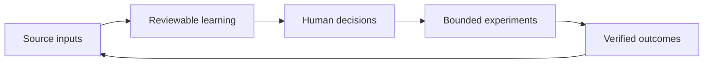
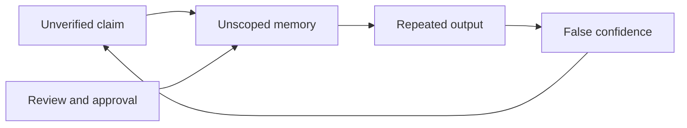

# User Value System and Controlled Flywheel

## 1. Document Status and Purpose

| Field | Value |
|---|---|
| Status | Candidate vision input |
| Version | 0.1 |
| Authority | Non-normative; human review required |
| Traceability | [GitHub issue #6](https://github.com/frwkHoangQuy/Mnemograph_workbench/issues/6) |
| Relationship to authority | This document does not supersede, amend, reinterpret, or replace the accepted Project Charter, accepted System Design, or accepted ADRs. |

This candidate frames the workbench from the user's perspective before any future North Star architecture revision. It explores how a user may progressively turn scientific knowledge, current market signals, personal ideas, and verified experience into learning, decisions, experiments, products, and organizational capability.

It is deliberately not a product promise or an implementation plan. It does not make architecture, database, provider, framework, or delivery decisions. In particular, it does not revise Delivery D1 or authorize Delivery D1.2.

## 2. Candidate User-Centric North Star Statement

Help people turn trusted evidence, current signals, and their own observations into reviewable learning, deliberate decisions, bounded experiments, and reusable capability while preserving provenance, privacy, and human authority.

The intended value is controlled progress rather than guaranteed growth. A useful outcome may be a better question, a rejected hypothesis, a decision to stop, or a documented limitation as well as a successful experiment.

## 3. User Problem and Value Proposition

Users often move between disconnected research, note-taking, market-reading, decision, and coordination tools. Evidence is separated from the claims it informed; market signals are mistaken for customer demand; assumptions become remembered as facts; and chat transcripts become a poor substitute for decisions and artifacts that a person can review later.

The candidate value proposition is a user-controlled environment that keeps the path from source to claim, objection, rationale, decision, experiment, and outcome inspectable. It should help a user decide what to learn next, what requires validation, and what should not yet be treated as knowledge. It should not present an answer merely because a model can produce one.

## 4. User Archetypes

- **Learner:** develops understanding from source material, questions, examples, and feedback. The useful output is a reviewable learning artifact, not a claim of mastery.
- **Researcher or creator:** develops hypotheses, concepts, research packages, designs, or creative directions while preserving distinctions among evidence, inference, and preference.
- **Builder or founder:** turns an insight into a bounded customer or operational experiment, with explicit success criteria and outcome evidence rather than trend-following alone.
- **Organization operator:** coordinates linked work, decision rationale, approved memory, and accountability across people and rooms.

These are not fixed user identities. One person may begin as a Learner, become a Researcher or creator, run an experiment as a Builder or founder, and later act as an Organization operator. The system should support that progression without requiring the person to understand organizational design before starting.

## 5. Progressive User Value Ladder

| Step | User action | Reviewable artifact | Control point |
|---|---|---|---|
| 1. Orient | State a question, objective, or uncertainty | Question and scope note | User decides whether the question is worth pursuing |
| 2. Learn | Examine sources, examples, and competing explanations | Labeled claims, objections, and learning notes | Source and epistemic status remain visible |
| 3. Frame | Connect evidence, ideas, and constraints | Insight candidate and decision rationale | Human review distinguishes accepted knowledge from a candidate |
| 4. Test | Define a customer, user, research, or operational experiment | Experiment brief with success and stop criteria | Scientific opportunity is not assumed to be commercially viable |
| 5. Observe | Collect customer and real outcome evidence | Outcome record, including negative results | Web trends alone do not validate commercial value |
| 6. Reuse | Share an approved practice or finding | Memory candidate or organizational artifact | Explicit scope and approval are required before persistence or reuse |

The ladder is not a funnel that every user must complete. A user may stop at learning, reopen a prior question, or reject an insight after new evidence. Progress means improving the quality and traceability of a decision, not merely moving forward.

## 6. Four Composable Product Spaces

The following names are candidate user-facing spaces, not prescribed modules, services, or delivery commitments. A user should be able to begin with one standalone room and progressively compose roles and linked rooms. The system should propose suitable room and role configurations from the user's goal so that organizational design expertise is not a prerequisite.

| Product space | User purpose | Typical reviewable artifacts | Boundary |
|---|---|---|---|
| **Research Studio** | Investigate a question with source-aware claims and objections | Research question, evidence links, claim map, limitations | Does not treat a source list or model answer as accepted knowledge by itself |
| **Learning Studio** | Build understanding from materials and practice | Learning plan, explanation, questions, reflection, evidence-backed notes | Does not equate exposure to content with learning or expertise |
| **Venture Studio** | Turn an insight into a bounded commercial hypothesis | Customer problem statement, experiment brief, interview record, outcome evidence | Does not infer demand from scientific merit, web attention, or internal enthusiasm |
| **Organization Studio** | Coordinate connected rooms, decisions, and approved organizational memory | Shared decision record, role proposal, operating artifact, approved memory entry | Does not silently absorb private or room-only material into organization-wide knowledge |

## 7. Primary User Journeys

### Standalone Learning Room

One user begins with a question and a small set of materials. The room helps organize a learning objective, distinguish source-backed statements from model prior knowledge, record objections and unresolved questions, and produce a reviewable learning artifact. The user can intervene, narrow scope, pause, or stop without turning the room into shared memory.

### Research-to-Validated-Insight

A user brings a research question, source material, and a provisional idea. The work produces visible claims, supporting and counter-evidence, objections, limitations, and a decision rationale. A human may accept a bounded insight, reject it, defer it, or preserve it only as a memory candidate. Acceptance is not automatic and must not be inferred from repeated model output.

### Insight-to-Commercial-Experiment

A user turns an accepted or still-provisional insight into a commercial hypothesis. The journey requires a defined customer or user, an observable outcome, and a way to disconfirm the hypothesis. Current web sources can identify signals or questions, but commercial validation requires customer and real outcome evidence such as interviews, observed behavior, commitments, pilots, revenue, retention, or another human-approved measure.

### Multi-Room Organizational Operation

An organization links rooms only when a human chooses to do so. Shared goals, decision records, and approved memory can travel across rooms with recorded scope and ownership; private and room-only materials do not. The system may suggest linked rooms or role configurations, but people retain authority to approve, alter, or reject the proposed structure.

## 8. Controlled Reinforcing Flywheels

The intended system is a controlled self-reinforcing system, not a promise of infinite or automatic value. Each loop requires evidence, review, user action, and the ability to pause or reverse course.

- **Knowledge and learning flywheel:** Sources and user questions produce reviewable learning. Better questions and visible limitations can improve future research, but only when provenance and objections remain attached.
- **Commercialization and market-feedback flywheel:** A bounded experiment produces customer and outcome evidence that can refine, narrow, or reject a commercial hypothesis. Scientific opportunity, a compelling concept, and web activity are inputs to investigate, not proof of commercial viability.
- **System-evaluation and improvement flywheel:** Reviewable artifacts and outcome evidence can identify where the system helped, confused, or failed the user. Any system-level learning from sessions is restricted to material covered by explicit opt-in and must preserve scope, privacy, and provenance.

## 9. Source and Epistemic Classifications

Every material item and derived statement should have a visible classification. Classification communicates what a statement can support; it does not make it true.

| Classification | Candidate use | Required caution |
|---|---|---|
| **User-provided documents** | Personal context, project material, and user-selected evidence | May carry copyright, licensing, confidentiality, privacy, and retention constraints; user provision does not automatically grant reuse rights |
| **Scientific sources** | Support or challenge scientific claims | Preserve source identity, version, locator, scope, quality, and counter-evidence; a paper does not settle a claim outside its actual support |
| **Current web sources** | Timely market, policy, product, or public-context signals | Record retrieval time and source context; web content is volatile and is not customer validation by itself |
| **Organizational knowledge** | Approved operating context and institutional learning | Requires owner, scope, access, retention, and approval status; it is not automatically scientific evidence |
| **Deterministic tool output** | Reproducible calculations, transformations, or measurements | Record inputs, method, version, and limits; reproducibility does not establish relevance or causality |
| **Model prior knowledge** | A prompt for investigation, alternatives, or questions | Treat as unverified until separately grounded; it must not be promoted to accepted knowledge by repetition |
| **Inference, assumption, and recommendation** | Reasoning between evidence and action | Label distinctly from evidence and accepted knowledge; record rationale, uncertainty, and the responsible human decision |

**Accepted knowledge** is a human-accepted, reviewable statement with its basis and limitations recorded. A **memory candidate** is only a proposal to retain or reuse information; it is not accepted knowledge. Unverified model prior knowledge remains separate from both.

## 10. Trust and Provenance Principles

- Preserve visible links among sources, claims, objections, evidence, limitations, and decision rationale where feasible.
- Record source identity, retrieval or snapshot context, relevant rights constraints, and the difference between source content and a derived statement.
- Make disagreement, counter-evidence, uncertainty, and a decision to defer visible rather than smoothing them into a single confident narrative.
- Represent outputs as reviewable artifacts and decisions, not only raw chat. A transcript may provide context, but it is not automatically a durable decision record.
- Keep private model chain-of-thought neither required nor exposed. The useful public record is a concise, reviewable rationale, evidence basis, uncertainty, and human decision.
- Respect licensing, copyright, confidentiality, privacy, and retention constraints for scientific papers, web content, user material, and organizational knowledge.

## 11. User Data Ownership and Memory Scopes

User data is private by default. A session must not become organizational memory, system-learnable material, training data, or a public case study through implication, repeated use, or an agent suggestion. Each promotion requires the explicit approval appropriate to its target scope.

| Scope | Meaning | Promotion rule |
|---|---|---|
| **Private** | Visible only to the user or explicitly authorized individuals | Default for new user material and session content |
| **Room-only** | Available within one named room and its authorized participants | Does not become workspace or organizational memory automatically |
| **Workspace-shared** | Available to a defined workspace audience | Requires explicit user or owner approval and stated access boundaries |
| **Approved organizational memory** | Reusable organizational knowledge with a named owner and rationale | Requires separate explicit approval, provenance, retention, and access decisions |
| **System-learnable** | Material eligible for system evaluation or improvement | Requires explicit opt-in; absence of opt-in means exclusion |
| **Public case study** | Material that may be shared outside the authorized organization | Requires a separate explicit opt-in; it cannot be inferred from any other approval |

**Per-turn context** is the bounded set of material selected for one response or interaction. It can be transient and should not imply retention. **System memory** is persistent material intended for later retrieval or reuse and must carry scope, provenance, owner, and approval status. A memory candidate is not system memory until its promotion is explicitly approved.

## 12. Human Authority and Approval Boundaries

Humans retain authority to set goals, approve or revise scope, accept or reopen conclusions, promote material to a memory scope, authorize external action, decide what may be published, and accept any normative change. Human review is required even when an output appears well-supported or operationally useful.

Role-agents may draft, summarize, challenge, classify, and recommend. They must not independently commit funds, enter contracts, make legal representations, publish externally, initiate production activity, or make a decision binding on a person or organization. A request for those actions must remain a reviewable human decision point.

## 13. AI Role-Agent Versus Employee and Legal-Authority Distinction

An employee or department metaphor may make a role easier for users to understand. It must not obscure the actual status of a role-agent: a configurable software principal with constrained instructions, tools, context, and outputs.

Role-agents are not employees, officers, legal agents, contracting parties, or accountable owners by implication. They do not gain financial, legal, publishing, production, or contractual authority merely because a user-facing label resembles a job title. A named human remains responsible for approvals and real-world commitments.

## 14. Positive Feedback Loops

| Loop | Potential user benefit | Required control |
|---|---|---|
| Reviewable learning | Better questions and less repeated research | Keep source links, limitations, and counter-evidence visible |
| Decision rationale | Less rediscovery of why a choice was made | Permit revision and record changed assumptions rather than treating old rationale as permanent truth |
| Commercial experimentation | Faster rejection or refinement of weak hypotheses | Require customer and real outcome evidence, not web trends alone |
| Approved organizational memory | More consistent reuse of vetted practices | Require ownership, access scope, retention, and explicit promotion |
| System evaluation | Better identification of helpful and harmful system behavior | Limit learning to explicitly opted-in material and measure user outcomes, not only activity |

These loops are positive only when their controls operate. More reuse, more activity, or more generated content is not inherently better.

## 15. Negative or Failure-Amplifying Loops

Potential failure-amplifying loops include:

- **Confidence loop:** an unverified claim enters unscoped memory, appears repeatedly, and acquires false credibility. Provenance, visible uncertainty, and explicit promotion gates contain this loop.
- **Trend-chasing loop:** web attention is mistaken for demand, producing experiments that lack a real customer problem or measurable outcome. Customer and outcome evidence are required to test commercial value.
- **Memory-contamination loop:** private, room-only, or low-quality material spreads into shared memory and then shapes later outputs. Scope boundaries, ownership, retention decisions, and opt-in prevent silent propagation.
- **Authority-creep loop:** increasingly capable drafts are mistaken for authority to act. Human approval gates must remain explicit for legal, financial, contractual, publishing, and production consequences.
- **Metric-theater loop:** token, cost, or activity measures displace user learning and outcome measures. North Star metrics must remain tied to user value and real outcomes.

## 16. North Star Metrics

The following are candidate metrics for later human review. They are not target commitments, performance guarantees, or telemetry requirements.

| Candidate metric | What it would measure | Guardrail |
|---|---|---|
| Time to a reviewable artifact | Whether a user can reach a source-aware learning, decision, or experiment artifact | Faster is not better if provenance or user control declines |
| Traceability coverage | Portion of accepted claims and decisions with visible basis, objections, and rationale | Do not count unsupported output as traceable merely because it has citations |
| Learning progress | User-reported or assessed change in understanding over a defined interval | Separate confidence from demonstrated understanding |
| Decision quality and reversibility | Whether important assumptions, alternatives, and reasons are recorded and can be reopened | A lower reversal rate is not automatically better if it discourages correction |
| Experiment evidence quality | Share of commercial experiments with identified customers and real outcome evidence | Web signals and internal votes alone do not qualify |
| Outcome realization | Whether experiments lead to verified learning, customer value, operational improvement, or a justified stop decision | Count negative outcomes when they prevent wasted effort |
| Approved reuse quality | Whether organizational memory is reused with correct scope and provenance | Never reward unauthorized sharing or retention |

Token usage, latency, and cost can be operational indicators, but they are not sufficient North Star measures of user value.

## 17. First MVP User Journey

The first MVP remains the existing single-room Scientist-SA-Moderator workflow with user intervention and two final documents. This candidate does not alter its scope or define its implementation.

1. A user opens one standalone room with a bounded goal and provides or selects permitted context.
2. The Scientist role develops source-grounded claims and limitations; the SA role records challenges, system implications, and unresolved risks; the Moderator keeps the interaction visible and available for user intervention.
3. The user can guide, revise scope, pause, resume, accept a bounded result, reopen a question, or stop. No role-agent determines the final condition on the user's behalf.
4. The room records reviewable claims, objections, evidence, and decision rationale without exposing private model chain-of-thought.
5. When the accepted baseline's publication conditions are met and the user requests it, the workflow produces the two distinct final documents: Scientific Rationale and Architecture Advisory. Their existence does not grant publishing, legal, or normative authority to a role-agent.

## 18. Assumptions

- Users and organizations can identify who may provide, view, share, retain, or approve their material.
- Users can decide whether a question should remain private, be shared within a room or workspace, or become an approved memory candidate.
- Scientific, market, and user material will have uneven quality, freshness, rights, and access constraints.
- Commercial hypotheses can be tested against actual customers or real-world outcomes when a user chooses to pursue them.
- A reviewable artifact can be more useful than a fast answer when decisions have material consequences.
- Suggested room and role configurations can reduce cognitive burden, but humans remain responsible for accepting the configuration and its authority boundaries.

## 19. Explicit Non-Goals

- This document does not revise the Project Charter, System Design, or accepted ADRs.
- It does not make architecture, database, provider, framework, model, workflow, or implementation decisions.
- It does not revise Delivery D1, authorize Delivery D1.2, or authorize any other Delivery D# work.
- It does not claim that scientific merit creates commercial value, that market attention proves demand, or that an experiment guarantees a product outcome.
- It does not make role-agents employees, legal representatives, financial authorities, publishers, production operators, or contractual parties.
- It does not authorize use of private data, organizational memory, system-learnable material, training data, or public case studies without the required explicit approval.

## 20. Open Questions Requiring Later Human Decisions

1. What evidence thresholds and review roles should apply before a statement becomes accepted knowledge in each user context?
2. What counts as sufficient customer and real outcome evidence for different experiment types and risk levels?
3. Which consent, access, retention, deletion, and audit policies are required for each memory scope?
4. How should licensing, copyright, confidentiality, and source attribution obligations be represented for user-provided documents, scientific sources, web content, and organizational material?
5. Who may approve organizational memory, system-learning opt-in, and public case-study opt-in, and how may those approvals be withdrawn?
6. Which user outcome metrics are meaningful without creating surveillance, metric gaming, or pressure to retain sensitive material?
7. Which room and role configuration suggestions are helpful across individual and organizational contexts without implying authority or organizational hierarchy?
8. Should the candidate names Research Studio, Learning Studio, Venture Studio, and Organization Studio remain the clearest user-facing concepts after human review?
